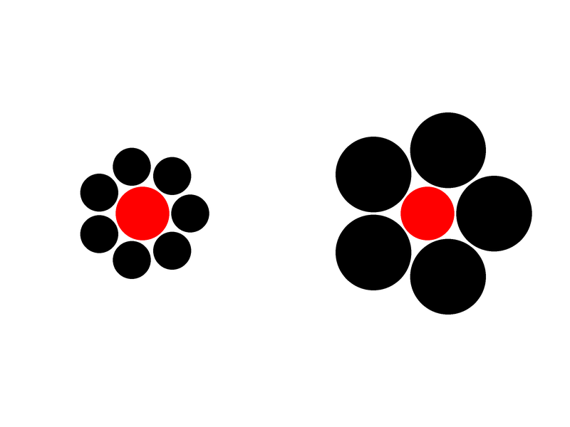
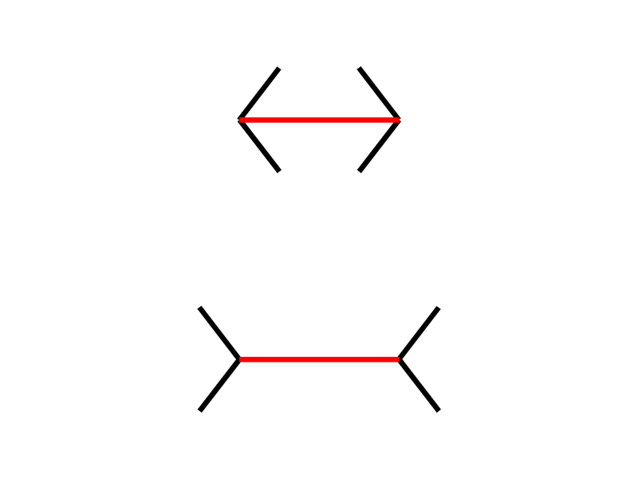

```{r, echo = FALSE, warning=FALSE, message=FALSE}
# options and parameters
options(digits=3)

knitr::opts_chunk$set(
  collapse = TRUE,
  dpi=450,
  fig.path = "docs/img/"
)

# Setup python - you need to change the path to your python distribution
library(reticulate)
reticulate::use_python("D:/Downloads/WPy64-3810/python-3.8.1.amd64/")
matplotlib <- import("matplotlib")
matplotlib$use("Agg", force = TRUE)
```


<p align="center">
  
</p>

<h5 align="center">*A Parametric Framework to Generate Visual Illusions using Python*</h5>

# Overview


Visual illusions are fascinating phenomena that have been used and studied by artists and scientists for centuries, leading to important discoveries about how conscious perception is generated by the brain. Instead of crafting them by hand, **Pyllusion** offers a framework to manipulate and generate illusions in a systematic way.

The parametric approach implemented in this software proposes to **describe illusions using a set of parameters**, such as for instance `difference` and `illusion_strength`, that will independently impact either the objective difference of the core components of the illusion (e.g., the difference between the two segments in the [Müller-Lyer](#müller-lyer-illusion-illusion) illusion) or the intensity of the illusion effect (e.g., the angle of the "distractors" arrows). Describing illusions using a set of parameters could foster **reproducible science**, as similar stimuli can be reported, generated and manipulated regardless of the display format and software.


## Installation

```
pip install https://github.com/DominiqueMakowski/Pyllusion/zipball/master
```

## Contribution

You have some ideas? Want to improve things, add new illusions, and help us shake people's brain? Let us know, we would be very happy to have you on board :relaxed:.

## Citation

You can cite the package as follows:

```
Makowski, D., Pham, T., Lau, Z. J. (2020). Pyllusion: A Parametric Framework to Generate Visual Illusions using Python. GitHub. 
Retrieved from https://github.com/DominiqueMakowski/Pyllusion
```

## Features


### Delboeuf Illusion

The [**Delboeuf illusion**](https://en.wikipedia.org/wiki/Delboeuf_illusion) is an optical illusion of relative size perception, where circles of identical size appear as different because of their surrounding context. The illusion was named for the Belgian philosopher, mathematician, experimental psychologist, hypnotist, and psychophysicist Joseph Remi Leopold Delboeuf (1831–1896), who created it in 1865.

```{python, warning=FALSE, message=FALSE, eval=FALSE}
import pyllusion as ill

parameters = ill.delboeuf_parameters(illusion_strength=3)
ill.delboeuf_image(parameters)
```
```{python message=FALSE, warning=FALSE, echo=FALSE}
import pyllusion as ill

img = ill.delboeuf_image(illusion_strength=3)
img.save("docs/img/README_delboeuf1.png")
```


### Ebbinghaus Illusion

The [**Ebbinghaus illusion**](https://en.wikipedia.org/wiki/Ebbinghaus_illusion) is an optical illusion of relative size perception, where circles of identical size appear as different because of their surrounding context (the right red circle appears as smaller). The illusion was named after its creator the German psychologist Hermann Ebbinghaus (1850–1909), though it got popularized by Edward B. Titchener in a 1901 textbook of experimental psychology.

```{python, warning=FALSE, message=FALSE, eval=FALSE}
parameters = ill.ebbinghaus_parameters(illusion_strength=2)
ill.ebbinghaus_image(parameters)
```
```{python message=FALSE, warning=FALSE, echo=FALSE}
img = ill.ebbinghaus_image(illusion_strength=2)
img.save("docs/img/README_ebbinghaus1.png")
```




### Müller-Lyer illusion Illusion

The [**Müller-Lyer illusion**](https://en.wikipedia.org/wiki/M%C3%BCller-Lyer_illusion) is an optical illusion causing the participant to perceive two segments as being of different length depending on the shape of the arrows. The illusion was named after its creator the erman sociologist Franz Carl Müller-Lyer (1857–1916) in 1889.

```{python, warning=FALSE, message=FALSE, eval=FALSE}
parameters = ill.mullerlyer_parameters(illusion_strength=30)
ill.mullerlyer_image(parameters)
```
```{python message=FALSE, warning=FALSE, echo=FALSE}
img = ill.mullerlyer_image(illusion_strength=30)
img.save("docs/img/README_mullerlyer1.png")
```




### Ponzo Illusion

The [**Ponzo illusion**](https://en.wikipedia.org/wiki/Ponzo_illusion) is an optical illusion of relative size perception, where horizontal lines of identical size appear as different because of their surrounding context (the top line appear as longer, as it is interepreted as being in the distance). The illusion was named after its creator the Italian psychologist Mario Ponzo (1882–1960) in 1911, who suggested that the human mind judges an object's size based on its background.

```{python, warning=FALSE, message=FALSE, eval=FALSE}
parameters = ill.ponzo_parameters(illusion_strength=20)
ill.ponzo_image(parameters)
```
```{python message=FALSE, warning=FALSE, echo=FALSE}
img = ill.ponzo_image(illusion_strength=20)
img.save("docs/img/README_ponzo1.png")
```


### Vertical–horizontal Illusion

The [**vertical–horizontal illusion**](https://en.wikipedia.org/wiki/Vertical%E2%80%93horizontal_illusion) illustrates the tendency for observers to overestimate the length of a vertical line relative to a horizontal line of the same length (Shipley et al., 1949).

```{python, warning=FALSE, message=FALSE, eval=FALSE}
parameters = ill.verticalhorizontal_parameters(illusion_strength=90)
ill.verticalhorizontal_image(parameters)
```
```{python message=FALSE, warning=FALSE, echo=FALSE}
img = ill.verticalhorizontal_image(illusion_strength=90)
img.save("docs/img/README_verticalhorizontal1.png")
```


### Zöllner Illusion

The [**Zöllner illusion**](https://en.wikipedia.org/wiki/Z%C3%B6llner_illusion) is an optical illusion, where horizontal lines are perceived as not parallel because of their background. It is named after its discoverer, the German astrophysicist Johann Karl Friedrich Zöllner in 1860.

```{python, warning=FALSE, message=FALSE, eval=FALSE}
parameters = ill.zollner_parameters(illusion_strength=75)
ill.zollner_image(parameters)
```
```{python message=FALSE, warning=FALSE, echo=FALSE}
img = ill.zollner_image(illusion_strength=75)
img.save("docs/img/README_zollner1.png")
```


### Rod and Frame Illusion

The [**Rod and frame illusion**](https://en.wikipedia.org/wiki/Rod_and_frame_test#Rod_and_frame_illusion) is an optical illusion causing the participant to perceive the rod to be oriented congruent with the orientation of the frame.

```{python, warning=FALSE, message=FALSE, eval=FALSE}
parameters = ill.rodframe_parameters(illusion_strength=11)
ill.rodframe_image(parameters)
```
```{python message=FALSE, warning=FALSE, echo=FALSE}
img = ill.rodframe_image(illusion_strength=11)
img.save("docs/img/README_rodframe1.png")
```


### Poggendorff Illusion

The [**Poggendorff illusion**](https://en.wikipedia.org/wiki/Poggendorff_illusion) is an optical illusion that involves the misperception of the position of one segment of a transverse line that has been interrupted by the contour of an intervening structure. It is named after Johann Christian Poggendorff who discovered in Zöllner's illusion after 1860. The magnitude of the illusion depends on the properties of the obscuring pattern and the nature of its borders.


- **TO DO** *(consider helping!)*

### Simultaneous Contrast illusion

A neutral gray target will appear lighter or darker than it does in isolation when compared to, respectively, a dark gray or light gray target. [**Simultaneous contrast**](https://en.wikipedia.org/wiki/Contrast_effect), identified by Michel Eugène Chevreul, refers to the manner in which the colors of two different objects affect each other. 

In the image here, the two inner rectangles are exactly the same shade of grey, but the upper one appears to be a lighter grey than the lower one due to the background provided by the outer rectangles.

```{python, warning=FALSE, message=FALSE, eval=FALSE}
parameters = ill.contrast_parameters(illusion_strength=-50)
ill.contrast_image(parameters)
```
```{python message=FALSE, warning=FALSE, echo=FALSE}
img = ill.contrast_image(illusion_strength=-50)
img.save("docs/img/README_contrast1.png")
```


### White Illusion

[**White's illusion**](https://en.wikipedia.org/wiki/White%27s_illusion) is a brightness illusion in which rectangles of the same grey color are perceived of different luminance depending on their background.


- **TO DO** *(consider helping!)*


### Chubb illusion

The [**Chubb illusion**](https://en.wikipedia.org/wiki/Chubb_illusion) is an optical illusion or error in visual perception in which the apparent contrast of an object varies substantially to most viewers depending on its relative contrast to the field on which it is displayed.


- **TO DO** *(consider helping!)*


### Autostereograms

[Autostereograms](https://en.wikipedia.org/wiki/Autostereogram) are images made of a pattern that is horizontally repeated (with slight variations) which, when watched with the appropriate focus, will generate an illusion of depth.

For instance, in the image below, the `autostereogram` automatically adds a guide (you can disable it by setting `guide=False`), the two red dots. Look at them and relax your eyes until you see a new red dot between them two. Then, try focusing on this new red dot until it gets very sharp and until your eyes stabilize. You should then be able to perceive the letters **3D** as carved in the figure

It can take a bit of time to "get there", but once you are used to it, it's a mind-blowing experience 🤯


```{python, warning=FALSE, message=FALSE, eval=FALSE}
ill.autostereogram(stimulus="3D", width=1600, height=900)
```
```{python message=FALSE, warning=FALSE, echo=FALSE}
img = ill.autostereogram(stimulus="3D", width=1600, height=900, font="arial.ttf")
img.save("docs/img/README_autostereogram1.png")
```


The function is highly customisable, and we can use a black and white image as a **depth mask** (in this case, the [picture of a skull](https://github.com/DominiqueMakowski/Pyllusion/docs/img/depthmask.png) that you will see as emerging from the background), and customise the pattern used by providing another function (here, the `image_circles()` function to which we can provide additional arguments like `blackwhite`, the number of circles `n`, their size range and their transparency with `alpha`).


```{python, warning=FALSE, message=FALSE, eval=FALSE}
ill.autostereogram(stimulus="docs/img/depthmask.png",
                   pattern=ill.image_circles,
                   blackwhite=True,
                   alpha=0.75,
                   size_min=0.005,
                   size_max=0.03,
                   n=1000)
```
```{python message=FALSE, warning=FALSE, echo=FALSE}
img = ill.autostereogram(stimulus="docs/img/depthmask.png",
                   pattern=ill.image_circles,
                   blackwhite=True,
                   alpha=0.75,
                   size_min=0.005,
                   size_max=0.03,
                   n=1000)
img.save("docs/img/README_autostereogram2.png")
```


### Transparency from Motion

- **TO DO** *(consider helping!)*

### Pattern Detection in Motion 

- **TO DO** *(consider helping!)*

## References

Bertamini, M. (2017). [*Programming visual illusions for everyone*](https://www.programmingvisualillusionsforeveryone.online). Springer.

