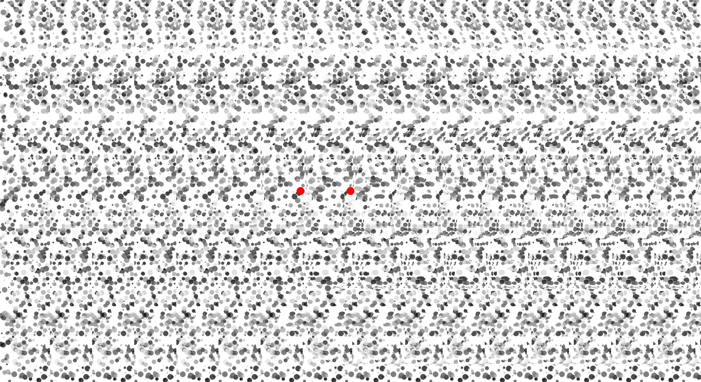

```{r, echo = FALSE, warning=FALSE, message=FALSE}
# options and parameters
options(digits=3)

knitr::opts_chunk$set(
  collapse = TRUE,
  dpi=450,
  fig.path = "docs/img/"
)

# Setup python - you need to change the path to your python distribution
library(reticulate)
reticulate::use_python("D:/Downloads/WPy64-3810/python-3.8.1.amd64/")
matplotlib <- import("matplotlib")
matplotlib$use("Agg", force = TRUE)
```


<p align="center">
  
</p>

<h5 align="center">*A Python Module for Generating Visual Illusions*</h5>

# Overview


Visual illusions are fascinating phenomena that have been used and studied by artists and scientists for centuries, leading to important discoveries about how conscious perception is generated by the brain. Instead of crafting them by hand, the **Pyllusion** software offers a framework to manipulate and generate them in a systematic way.

## Installation

```
pip install https://github.com/DominiqueMakowski/Pyllusion/zipball/master
```

## Contribution

You have some ideas? Want to improve things, add new illusions, and help us shake people's brain? Let us know, we would be very happy to have you on board :relaxed:.

## Citation

You can cite the package as follows:

```
Makowski, D. (2020). Pyllusion: A Python Module for Generating Visual Illusions. GitHub. 
Retrieved from https://github.com/DominiqueMakowski/Pyllusion
```

## Features

### Delboeuf Illusion

The [**Delboeuf illusion**](https://en.wikipedia.org/wiki/Delboeuf_illusion) is an optical illusion of relative size perception, where circles of identical size appear as different because of their surrounding context. The illusion was named for the Belgian philosopher, mathematician, experimental psychologist, hypnotist, and psychophysicist Joseph Remi Leopold Delboeuf (1831–1896), who created it in 1865.

```{python, warning=FALSE, message=FALSE, eval=FALSE}
import pyllusion as ill

ill.delboeuf_image(illusion_strength=3)
```
```{python message=FALSE, warning=FALSE, echo=FALSE}
import pyllusion as ill

img = ill.delboeuf_image(illusion_strength=3)
img.save("docs/img/README_delboeuf1.png")
```


### Ebbinghaus Illusion

The [**Ebbinghaus illusion**](https://en.wikipedia.org/wiki/Ebbinghaus_illusion) is an optical illusion of relative size perception, where circles of identical size appear as different because of their surrounding context (the right red circle appears as smaller). The illusion was named after its creator the German psychologist Hermann Ebbinghaus (1850–1909), though it got popularized by Edward B. Titchener in a 1901 textbook of experimental psychology.

```{python, warning=FALSE, message=FALSE, eval=FALSE}
ill.ebbinghaus_image(illusion_strength=2)
```
```{python message=FALSE, warning=FALSE, echo=FALSE}
img = ill.ebbinghaus_image(illusion_strength=2)
img.save("docs/img/README_ebbinghaus1.png")
```


### Müller-Lyer illusion Illusion

The [**Müller-Lyer illusion**](https://en.wikipedia.org/wiki/M%C3%BCller-Lyer_illusion) is an optical illusion causing the participant to perceive two segments as being of different length depending on the shape of the arrows. The illusion was named after its creator the erman sociologist Franz Carl Müller-Lyer (1857–1916) in 1889.

```{python, warning=FALSE, message=FALSE, eval=FALSE}
ill.mullerlyer_image(illusion_strength=30)
```
```{python message=FALSE, warning=FALSE, echo=FALSE}
img = ill.mullerlyer_image(illusion_strength=30)
img.save("docs/img/README_mullerlyer1.png")
```


### Ponzo Illusion

The [**Ponzo illusion**](https://en.wikipedia.org/wiki/Ponzo_illusion) is an optical illusion of relative size perception, where horizontal lines of identical size appear as different because of their surrounding context (the top line appear as longer, as it is interepreted as being in the distance). The illusion was named after its creator the Italian psychologist Mario Ponzo (1882–1960) in 1911, who suggested that the human mind judges an object's size based on its background.

```{python, warning=FALSE, message=FALSE, eval=FALSE}
ill.ponzo_image(illusion_strength=20)
```
```{python message=FALSE, warning=FALSE, echo=FALSE}
img = ill.ponzo_image(illusion_strength=20)
img.save("docs/img/README_ponzo1.png")
```


### Rod and Frame Illusion

The [**Rod and frame illusion**](https://en.wikipedia.org/wiki/Rod_and_frame_test#Rod_and_frame_illusion) is an optical illusion causing the participant to perceive the rod to be oriented congruent with the orientation of the frame.

```{python, warning=FALSE, message=FALSE, eval=FALSE}
ill.rodframe_image(illusion_strength=11)
```
```{python message=FALSE, warning=FALSE, echo=FALSE}
img = ill.rodframe_image(illusion_strength=11)
img.save("docs/img/README_rodframe1.png")
```


### Zöllner illusion Illusion

- **TO DO** *(consider helping!)*

### Münsterberg Illusion (Café Wall)

- **TO DO** *(consider helping!)*

### White illusion

- **TO DO** *(consider helping!)*

### Autostereograms

[Autostereograms](https://en.wikipedia.org/wiki/Autostereogram) are images made of a pattern that is horizontally repeated (with slight variations) which, when watched with the appropriate focus, will generate an illusion of depth.

For instance, in the image below, the `autostereogram` automatically adds a guide (you can disable it by setting `guide=False`), the two red dots. Look at them and relax your eyes until you see a new red dot between them two. Then, try focusing on this new red dot until it gets very sharp and until your eyes stabilize. You should then be able to perceive the letters **3D** as carved in the figure

It can take a bit of time to "get there", but once you are used to it, it's a mind-blowing experience 🤯


```{python, warning=FALSE, message=FALSE, eval=FALSE}
ill.autostereogram(stimulus="3D", width=1600, height=900)
```
```{python message=FALSE, warning=FALSE, echo=FALSE}
img = ill.autostereogram(stimulus="3D", width=1600, height=900, font="arial.ttf")
img.save("docs/img/README_autostereogram1.png")
```


The function is highly customisable, and we can use a black and white image as a **depth mask** (in this case, the [picture of a skull](https://github.com/DominiqueMakowski/Pyllusion/docs/img/depthmask.png) that you will see as emerging from the background), and customise the pattern used by providing another function (here, the `image_circles()` function to which we can provide additional arguments like `blackwhite`, the number of circles `n`, their size range and their transparency with `alpha`).


```{python, warning=FALSE, message=FALSE, eval=FALSE}
ill.autostereogram(stimulus="docs/img/depthmask.png",
                   pattern=ill.image_circles,
                   blackwhite=True,
                   alpha=0.75,
                   size_min=0.005,
                   size_max=0.03,
                   n=1000)
```
```{python message=FALSE, warning=FALSE, echo=FALSE}
img = ill.autostereogram(stimulus="docs/img/depthmask.png",
                   pattern=ill.image_circles,
                   blackwhite=True,
                   alpha=0.75,
                   size_min=0.005,
                   size_max=0.03,
                   n=1000)
img.save("docs/img/README_autostereogram2.png")
```



## References

Bertamini, M. (2017). [*Programming visual illusions for everyone*](https://www.programmingvisualillusionsforeveryone.online). Springer.

