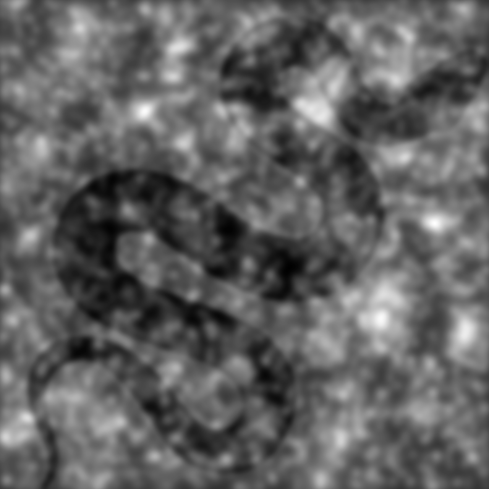

```{r, echo = FALSE, warning=FALSE, message=FALSE}
# options and parameters
options(digits=3)

knitr::opts_chunk$set(
  collapse = TRUE,
  dpi=450,
  fig.path = "docs/img/"
)


# Setup python - you need to change the path to your python distribution
library(reticulate)
# reticulate::use_python("D:/Downloads/WPy64-3902/python-3.9.0.amd64/")
reticulate::use_python("C:/Users/Zen Juen/Downloads/WPy64-3850/python-3.8.5.amd64")
# reticulate::use_python("C:/Users/Pham Thanh Tam/Desktop/WPy-3710b/python-3.7.1.amd64")


# matplotlib <- import("matplotlib")
# matplotlib$use("Agg", force = TRUE)

```


[](https://github.com/RealityBending/Pyllusion/actions/workflows/tests.yml)
[](https://journals.sagepub.com/doi/10.1177/03010066211057347)

**A Parametric Framework to Generate Visual Illusions using Python**

# Overview


Visual illusions are fascinating phenomena that have been used and studied by artists and scientists for centuries, leading to important discoveries about how conscious perception is generated by the brain. Instead of crafting them by hand, **Pyllusion** offers a framework to manipulate and generate illusions in a systematic way.

The parametric approach implemented in this software proposes to **describe illusions using a set of parameters**, such as for instance the *difference* and *illusion strength*. These two parameters can be modulated to independently impact either the objective difference of the core components of the illusion (e.g., the difference between the two segments in the [Müller-Lyer](#müller-lyer-illusion-illusion) illusion) or the intensity of the illusion effect (e.g., the angle of the "distractors" arrows). 

Describing illusions using a set of parameters aims at fostering **reproducible science**, allowing neuroscientists to easily report, generate and manipulate similar stimuli regardless of the display format and software.


## Installation

```
pip install https://github.com/RealityBending/Pyllusion/zipball/master
```

You can also find the installation instructions for Python 3 [here](https://realpython.com/installing-python/).

## Contribution

You have some ideas? Want to improve things, add new illusions, and help us shake people's brain? Let us know, we would be very happy to have you on board :relaxed:.

## Share Your Data

If you have used **Pyllusion** in your experiments, and have made your scripts and data open access, feel free to also reference the link to your data by opening [an issue](https://github.com/RealityBending/Pyllusion/issues) with the **Experiment Report** template.


## Citation

You can cite the package as follows:

```
Makowski, D., Pham, T., Lau, Z. J. (2020). Pyllusion: A Parametric Framework to Generate Visual Illusions using Python. GitHub. 
Retrieved from https://github.com/RealityBending/Pyllusion
```

## Features


### Delboeuf Illusion

The **[Delboeuf illusion](https://en.wikipedia.org/wiki/Delboeuf_illusion)** is an optical illusion of relative size perception, where circles of identical size appear as different because of their surrounding context. The illusion was named for the Belgian philosopher, mathematician, experimental psychologist, hypnotist, and psychophysicist Joseph Remi Leopold Delboeuf (1831–1896), who created it in 1865.

```{python, warning=FALSE, message=FALSE, eval=FALSE}
import pyllusion

delboeuf = pyllusion.Delboeuf(illusion_strength=3)
delboeuf.to_image()
```

```{python message=FALSE, warning=FALSE, echo=FALSE}
import pyllusion
import PIL

delboeuf = pyllusion.Delboeuf(illusion_strength=3)
img = delboeuf.to_image()
img.save("docs/img/README_delboeuf1.png")
```


### Ebbinghaus Illusion

The **[Ebbinghaus illusion](https://en.wikipedia.org/wiki/Ebbinghaus_illusion)** is an optical illusion of relative size perception, where circles of identical size appear as different because of their surrounding context (the right red circle appears as smaller because its surrounding circle is larger). The illusion was named after its creator the German psychologist Hermann Ebbinghaus (1850–1909), though it got popularized by Edward B. Titchener in a 1901 textbook of experimental psychology.

The Ebbinghaus illusion is considered a high-level integration illusion (King et al., 2017) which has been considered relatively unaffected amongst schizophrenics (as compared to healthy controls), who have problems in contextual processing of visual stimuli. Specifically, greater disorganized schizophrenia symptoms are related to a higher resistance towards the Ebbinghaus illusion (Uhlhaas et al., 2006).  Reduced sensitivity of schizophrenics to this illusion has been used to reflect how prior knowledge influences perceptual organization to a lesser extent, i.e., reduced top-down influence, in schizophrenia (Silverstein & Keane, 2011).


```{python, warning=FALSE, message=FALSE, eval=FALSE}
ebbinghaus = pyllusion.Ebbinghaus(illusion_strength=2)
ebbinghaus.to_image()
```
```{python message=FALSE, warning=FALSE, echo=FALSE}
ebbinghaus = pyllusion.Ebbinghaus(illusion_strength=2)
img = ebbinghaus.to_image()
img.save("docs/img/README_ebbinghaus1.png")
```


### Müller-Lyer Illusion

The **[Müller-Lyer illusion](https://en.wikipedia.org/wiki/M%C3%BCller-Lyer_illusion)** is an optical illusion causing the participant to perceive two segments as being of different length depending on the shape of the arrows. The illusion was named after its creator the erman sociologist Franz Carl Müller-Lyer (1857–1916) in 1889.

The Müller-Lyer illusion is a high-level integration illusion requiring contextual processing by the brain (King et al., 2017). The effect of this illusion in schizophrenics appears to be more mixed, with some studies finding greater resistance to it (e.g., Parnas et al., 2001) and others showing increased susceptibility (e.g., Kantrowitz et al., 2009). There is some evidence that susceptibility to the Müller-Lyer illusion is negatively correlated with autistic traits in the typical population (but not with the Ebbinghaus nor the Ponzo illusion) (Chouinard et al., 2013).

```{python, warning=FALSE, message=FALSE, eval=FALSE}
mullerlyer = pyllusion.MullerLyer(illusion_strength=30)
mullerlyer.to_image()
```
```{python message=FALSE, warning=FALSE, echo=FALSE}
mullerlyer = pyllusion.MullerLyer(illusion_strength=30)
img = mullerlyer.to_image()
img.save("docs/img/README_mullerlyer1.png")
```


### Ponzo Illusion

The **[Ponzo illusion](https://en.wikipedia.org/wiki/Ponzo_illusion)** is an optical illusion of relative size perception, where horizontal lines of identical size appear as different because of their surrounding context (the top line appear as longer, as it is interepreted as being in the distance). The illusion was named after its creator the Italian psychologist Mario Ponzo (1882–1960) in 1911, who suggested that the human mind judges an object's size based on its background.

Ponzo illusion is considered a high-level integration illusion as it is cognitively demanding in the sense that depth cues have to be correctly interpreted to signal changes in visual distance (King et al., 2017), requiring higher-level cortical processes (Song et al., 2011). Similar to the Ebbinghaus illusion, it is also shown to have less effect in biasing perception in schizophrenic subjects (Kantrowitz et al., 2009).

```{python, warning=FALSE, message=FALSE, eval=FALSE}
ponzo = pyllusion.Ponzo(illusion_strength=20)
ponzo.to_image()
```
```{python message=FALSE, warning=FALSE, echo=FALSE}
ponzo = pyllusion.Ponzo(illusion_strength=20)
img = ponzo.to_image()
img.save("docs/img/README_ponzo1.png")
```


### Vertical–horizontal Illusion

The **[vertical–horizontal illusion](https://en.wikipedia.org/wiki/Vertical%E2%80%93horizontal_illusion)** illustrates the tendency for observers to overestimate the length of a vertical line relative to a horizontal line of the same length (Shipley et al., 1949).

```{python, warning=FALSE, message=FALSE, eval=FALSE}
verticalhorizontal = pyllusion.VerticalHorizontal(illusion_strength=-90)
verticalhorizontal.to_image()
```
```{python message=FALSE, warning=FALSE, echo=FALSE}
verticalhorizontal = pyllusion.VerticalHorizontal(illusion_strength=-90)
img = verticalhorizontal.to_image()
img.save("docs/img/README_verticalhorizontal1.png")
```


### Zöllner Illusion

The **[Zöllner illusion](https://en.wikipedia.org/wiki/Z%C3%B6llner_illusion)** is an optical illusion, where horizontal lines are perceived as not parallel because of their background. It is named after its discoverer, the German astrophysicist Johann Karl Friedrich Zöllner in 1860.

```{python, warning=FALSE, message=FALSE, eval=FALSE}
zollner = pyllusion.Zollner(illusion_strength=75)
zollner.to_image()
```
```{python message=FALSE, warning=FALSE, echo=FALSE}
zollner = pyllusion.Zollner(illusion_strength=75)
img = zollner.to_image()
img.save("docs/img/README_zollner1.png")
```


### Rod and Frame Illusion

The **[Rod and frame illusion](https://en.wikipedia.org/wiki/Rod_and_frame_test#Rod_and_frame_illusion)** is an optical illusion causing the participant to perceive the rod to be oriented congruent with the orientation of the frame.

```{python, warning=FALSE, message=FALSE, eval=FALSE}
rodframe = pyllusion.RodFrame(illusion_strength=-11)
rodframe.to_image()
```
```{python message=FALSE, warning=FALSE, echo=FALSE}
rodframe = pyllusion.RodFrame(illusion_strength=-11)
img = rodframe.to_image()
img.save("docs/img/README_rodframe1.png")
```


### Poggendorff Illusion

The **[Poggendorff illusion](https://en.wikipedia.org/wiki/Poggendorff_illusion)** is an optical illusion that involves the misperception of the position of one segment of a transverse line that has been interrupted by the contour of an intervening structure. It is named after Johann Christian Poggendorff who discovered in Zöllner's illusion after 1860. The magnitude of the illusion depends on the properties of the obscuring pattern and the nature of its borders.

```{python, warning=FALSE, message=FALSE, eval=FALSE}
poggendorff = pyllusion.Poggendorff(illusion_strength=-50)
poggendorff.to_image()
```
```{python message=FALSE, warning=FALSE, echo=FALSE}
poggendorff = pyllusion.Poggendorff(illusion_strength=-50)
img = poggendorff.to_image()
img.save("docs/img/README_poggendorff1.png")
```


### Simultaneous Contrast illusion

A neutral gray target will appear lighter or darker than it does in isolation when compared to, respectively, a dark gray or light gray target. **[Simultaneous contrast](https://en.wikipedia.org/wiki/Contrast_effect)**, identified by Michel Eugène Chevreul, refers to the manner in which the colors of two different objects affect each other. 

In the image here, the two inner rectangles are exactly the same shade of grey, but the upper one appears to be a lighter grey than the lower one due to the background provided by the outer rectangles.

```{python, warning=FALSE, message=FALSE, eval=FALSE}
contrast = pyllusion.Contrast(illusion_strength=-50)
contrast.to_image()
```
```{python message=FALSE, warning=FALSE, echo=FALSE}
contrast = pyllusion.Contrast(illusion_strength=-50)
img = contrast.to_image()
img.save("docs/img/README_contrast1.png")
```


### White Illusion

**[White's illusion](https://en.wikipedia.org/wiki/White%27s_illusion)** is a brightness illusion in which rectangles of the same grey color are perceived of different luminance depending on their background.

```{python, warning=FALSE, message=FALSE, eval=FALSE}
white = pyllusion.White(illusion_strength=100)
white.to_image()
```
```{python message=FALSE, warning=FALSE, echo=FALSE}
white = pyllusion.White(illusion_strength=100)
img = white.to_image()
img.save("docs/img/README_white1.png")
```


<!-- ### Chubb illusion -->

<!-- The **[Chubb illusion](https://en.wikipedia.org/wiki/Chubb_illusion)** is an optical illusion or error in visual perception in which the apparent contrast of an object varies substantially to most viewers depending on its relative contrast to the field on which it is displayed. -->

<!--  -->

<!-- - **TO DO** *(consider helping!)* -->

### Kanizsa Square

The **Kanizsa Square** is an [illusory contour](https://en.wikipedia.org/wiki/Illusory_contours) illusion. See [Keane et al., 2019](https://www.ncbi.nlm.nih.gov/pmc/articles/PMC6667222/). 

Some studies have tested the effect of the Kanizsa Square in individuals with schizophrenia, but the finding of greater resistance to the illusion is not robust (King et al., 2017).


- **TO DO** *(consider helping!)*

### Autostereograms

**[Autostereograms](https://en.wikipedia.org/wiki/Autostereogram)** are images made of a pattern that is horizontally repeated (with slight variations) which, when watched with the appropriate focus, will generate an illusion of depth.

For instance, in the image below, the `autostereogram` automatically adds a guide (you can disable it by setting `guide=False`), the two red dots. Look at them and relax your eyes until you see a new red dot between them two. Then, try focusing on this new red dot until it gets very sharp and until your eyes stabilize. You should then be able to perceive the letters **3D** as carved in the figure

It can take a bit of time to "get there", but once you are used to it, it's a mind-blowing experience 🤯


````
autostereograms = pyllusion.Autostereogram(stimulus="3D", width=1600, height=900)
autostereograms.draw()
````

<!-- ```{python message=FALSE, warning=FALSE, echo=FALSE} -->
<!-- img = pyllusion.autostereogram(stimulus="3D", width=1600, height=900) -->
<!-- img.save("docs/img/README_autostereogram1.png") -->
<!-- ``` -->


The function is highly customisable, and we can use a black and white image as a **depth mask** (in this case, the [picture of a skull](https://github.com/DominiqueMakowski/Pyllusion/docs/img/depthmask.png) that you will see as emerging from the background), and customise the pattern used by providing another function (here, the `image_circles()` function to which we can provide additional arguments like `blackwhite`, the number of circles `n`, their size range and their transparency with `alpha`).


````
autostereograms = pyllusion.Autostereogram(stimulus="docs/img/depthmask.png",
                   pattern=pyllusion.image_circles,
                   color="blackwhite",
                   alpha=0.75,
                   size_min=0.005,
                   size_max=0.03,
                   n=1000)
autostereograms.draw()
````

<!-- ```{python message=FALSE, warning=FALSE, echo=FALSE} -->
<!-- img = pyllusion.autostereogram(stimulus="docs/img/depthmask.png", -->
<!--                    pattern=pyllusion.image_circles, -->
<!--                    color="blackwhite", -->
<!--                    alpha=0.75, -->
<!--                    size_min=0.005, -->
<!--                    size_max=0.03, -->
<!--                    n=1000) -->
<!-- img.save("docs/img/README_autostereogram2.png") -->
<!-- ``` -->


### Pareidolia

Pareidolia is the tendency to incorrectly perceive of a stimulus as an object pattern or meaning known to the observer. [Liu et al. (2014)](https://www.ncbi.nlm.nih.gov/pmc/articles/PMC3980010/?mod=article_inline), in their study *"Seeing Jesus in toast"*, famously (the study got awarded an Ignobel prize) investigated the correlates of face pareidolia by blending images of faces with noise-like images.

Blending of images can be achieved: as followed

```{python, warning=FALSE, message=FALSE, eval=FALSE}
pareidolia = pyllusion.Pareidolia(pattern="docs/img/snake.png", 
                                 n=[20, 300, 4000], 
                                 sd=[4, 2, 1], 
                                 weight=[3, 2, 1],
                                 alpha=80,
                                 blur=0.5)
pareidolia.draw()
```
```{python message=FALSE, warning=FALSE, echo=FALSE}
pareidolia = pyllusion.Pareidolia(pattern="docs/img/snake.png", 
                                 n=[20, 300, 4000], 
                                 sd=[4, 2, 1], 
                                 weight=[3, 2, 1],
                                 alpha=80,
                                 blur=0.5)
img = pareidolia.draw()
img.save("docs/img/README_pareidolia.png")
```


### Transparency From Motion (TFM)

In visual perception, the **[kinetic depth effect](https://en.wikipedia.org/wiki/Kinetic_depth_effect)** refers to the phenomenon whereby the three-dimensional structural form of an object can be perceived when the object is moving (Wallach \& O'Connell, 1953; [Mamassian \& Wallace, 2010](https://jov.arvojournals.org/article.aspx?articleid=2191769)). One of its derivative is the **Transparency-From-Motion** illusion, consisting in the superposition of two dot clouds moving in different directions that results in the perception of two transparent layers (See ; [Schütz, 2014](https://jov.arvojournals.org/article.aspx?articleid=2193903); [Wexler et al., 2015](https://www.pnas.org/content/pnas/112/48/14990.full.pdf); [Schütz \& Mamassian, 2016](https://jov.arvojournals.org/article.aspx?articleid=2548036) and http://lab-perception.org/demo/p/tfm for a demo).

```{python, warning=FALSE, message=FALSE, eval=FALSE}
parameters = pyllusion.motiontransparency_parameters(angle=45)
images = pyllusion.motiontransparency_images(parameters)

pyllusion.images_to_gif(images, path="Transparency_From_Motion.gif", fps=parameters["FPS"])

```
```{python message=FALSE, warning=FALSE, echo=FALSE, eval=FALSE}
parameters = pyllusion.motiontransparency_parameters(angle=45)
images = pyllusion.motiontransparency_images(parameters)

pyllusion.images_to_gif(images, path="docs/img/README_TFM1.gif", fps=parameters["FPS"])
```


<!-- ### Pattern Detection in Motion  -->

<!-- - **TO DO** *(consider helping!)* -->


### Pinna illusion

See also **[Zeljic et al., 2021](https://www.sciencedirect.com/science/article/pii/S0278584620303717)**.

- **TO DO** *(consider helping!)*


### Monnier-Shevell illusion

See also [David Novick's](https://twitter.com/NovickProf) tweets [**here**](https://twitter.com/NovickProf/status/1348653264645009408), and [**here**](https://twitter.com/NovickProf/status/1358787676326031360).

- **TO DO** *(consider helping!)*


<!-- ### Exctinction illusion -->

<!-- See also [this tweet](https://twitter.com/AkiyoshiKitaoka/status/1351867885493211138/photo/1 by Akiyoshi Kitaoka). -->

<!-- - **TO DO** *(consider helping!)* -->

<!--  -->


## PsychoPy Integration

Pyllusion can be easily integrated into [PsychoPy](https://www.psychopy.org/) for running experiments as well!


```
# Load packages
import pyllusion
from psychopy import visual, event

# Create parameters
delboeuf = pyllusion.Delboeuf(illusion_strength=1, difference=2)

# Initiate Window
window = visual.Window(size=[1920, 1080], winType='pygame',
                       color='white', fullscr=False)

# Display illusion
delboeuf.to_psychopy(window)

# Refresh and close window
window.flip()
event.waitKeys()  # Press any key to close
window.close()
```


## References


Bertamini, M. (2017). *[Programming visual illusions for everyone](https://www.programmingvisualillusionsforeveryone.online)*. Springer.

Chouinard, P. A., Noulty, W. A., Sperandio, I., & Landry, O. (2013). Global processing during the Müller-Lyer illusion is distinctively affected by the degree of autistic traits in the typical population. Experimental Brain Research, 230(2), 219–231. 

Kantrowitz, J. T., Butler, P. D., Schecter, I., Silipo, G., & Javitt, D. C. (2009). Seeing the world dimly: The impact of early visual deficits on visual experience in schizophrenia. Schizophrenia Bulletin, 35(6), 1085–1094. doi:10.1093/schbul/sbp100

King, D. J., Hodgekins, J., Chouinard, P. A., Chouinard, V. A., & Sperandio, I. (2017). A review of abnormalities in the perception of visual illusions in schizophrenia. Psychonomic bulletin & review, 24(3), 734-751.

Parnas, J., Vianin, P., Saebye, D., Jansson, L., Volmer-Larsen, a, & Bovet, P. (2001). Visual binding abilities in the initial and advanced stages of schizophrenia. Acta Psychiatrica Scandinavica, 103(3), 171–180. doi:10.1034/j.1600-0447.2001.00160.x


Silverstein, S. M., & Keane, B. P. (2011). Perceptual organization impairment in schizophrenia and associated brain mechanisms: Review of research from 2005 to 2010. Schizophrenia Bulletin, 37(4), 690–699. doi:10.1093/schbul/sbr052

Song, C., Schwarzkopf, D. S., & Rees, G. (2011). Interocular induction of illusory size perception. BMC Neuroscience 27, 12(1).


Uhlhaas, P. J., Phillips, W. A., Schenkel, L. S., & Silverstein, S. M. (2006b). Theory of mind and perceptual context‐processing in schizophrenia. Cognitive Neuropsychiatry, 11(4), 416–436.

