**A Parametric Framework to Generate Visual Illusions using Python**


# Overview

Visual illusions are fascinating phenomena that have been used and
studied by artists and scientists for centuries, leading to important
discoveries about how conscious perception is generated by the brain.
Instead of crafting them by hand, **Pyllusion** offers a framework to
manipulate and generate illusions in a systematic way.

The parametric approach implemented in this software proposes to
**describe illusions using a set of parameters**, such as for instance
the *difference* and *illusion strength*. These two parameters can be
modulated to independently impact either the objective difference of the
core components of the illusion (e.g., the difference between the two
segments in the [Müller-Lyer](#müller-lyer-illusion-illusion) illusion)
or the intensity of the illusion effect (e.g., the angle of the
“distractors” arrows).

Describing illusions using a set of parameters aims at fostering
**reproducible science**, allowing neuroscientists to easily report,
generate and manipulate similar stimuli regardless of the display format
and software.

## PsychoPy Integration

Pyllusion can be easily integrated into [PsychoPy](https://www.psychopy.org/) for running experiments as well!

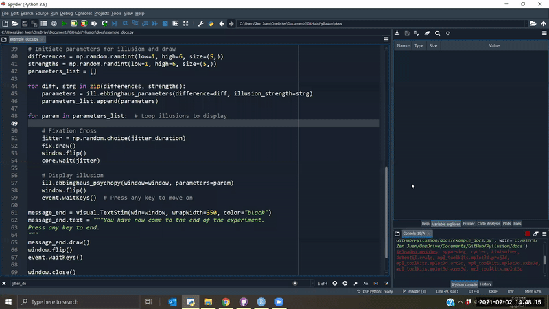


## Installation

    pip install https://github.com/RealityBending/Pyllusion/zipball/master

## Contribution

You have some ideas? Want to improve things, add new illusions, and help
us shake people’s brain? Let us know, we would be very happy to have you
on board :relaxed:.

## Citation

You can cite the package as follows:

    Makowski, D., Pham, T., Lau, Z. J. (2020). Pyllusion: A Parametric Framework to Generate Visual Illusions using Python. GitHub. 
    Retrieved from https://github.com/RealityBending/Pyllusion

## Features

### Delboeuf Illusion

The [**Delboeuf
illusion**](https://en.wikipedia.org/wiki/Delboeuf_illusion) is an
optical illusion of relative size perception, where circles of identical
size appear as different because of their surrounding context. The
illusion was named for the Belgian philosopher, mathematician,
experimental psychologist, hypnotist, and psychophysicist Joseph Remi
Leopold Delboeuf (1831–1896), who created it in 1865.

``` python
import pyllusion as ill

parameters = ill.delboeuf_parameters(illusion_strength=3)
ill.delboeuf_image(parameters)
```

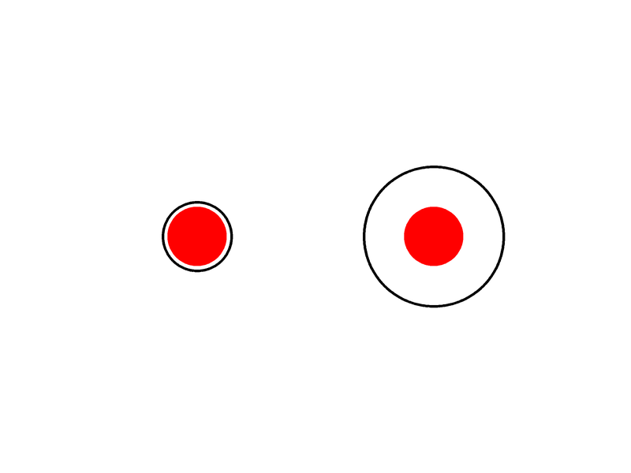

### Ebbinghaus Illusion

The [**Ebbinghaus
illusion**](https://en.wikipedia.org/wiki/Ebbinghaus_illusion) is an
optical illusion of relative size perception, where circles of identical
size appear as different because of their surrounding context (the right
red circle appears as smaller). The illusion was named after its creator
the German psychologist Hermann Ebbinghaus (1850–1909), though it got
popularized by Edward B. Titchener in a 1901 textbook of experimental
psychology.

``` python
parameters = ill.ebbinghaus_parameters(illusion_strength=2)
ill.ebbinghaus_image(parameters)
```

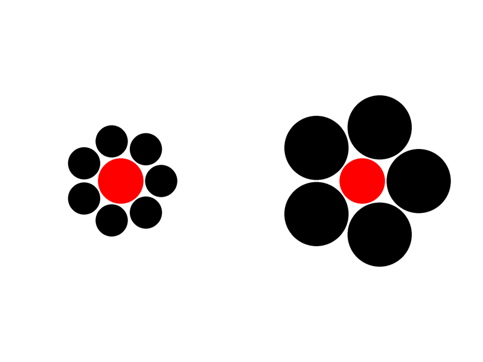

### Müller-Lyer illusion Illusion

The [**Müller-Lyer
illusion**](https://en.wikipedia.org/wiki/M%C3%BCller-Lyer_illusion) is
an optical illusion causing the participant to perceive two segments as
being of different length depending on the shape of the arrows. The
illusion was named after its creator the erman sociologist Franz Carl
Müller-Lyer (1857–1916) in 1889.

``` python
parameters = ill.mullerlyer_parameters(illusion_strength=30)
ill.mullerlyer_image(parameters)
```

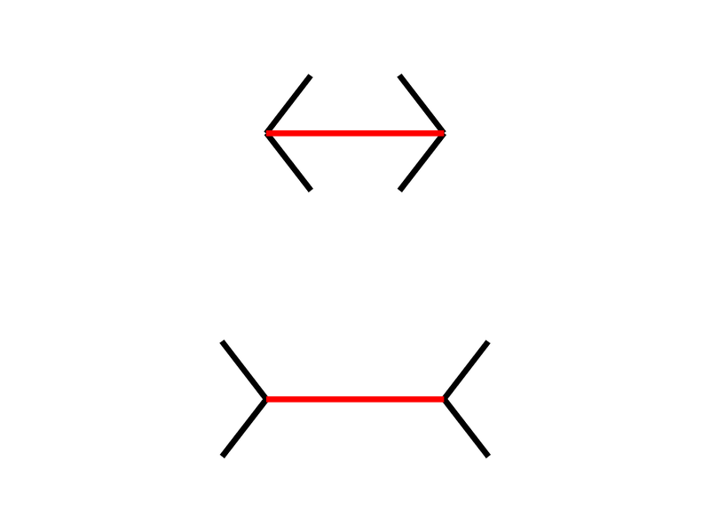

### Ponzo Illusion

The [**Ponzo illusion**](https://en.wikipedia.org/wiki/Ponzo_illusion)
is an optical illusion of relative size perception, where horizontal
lines of identical size appear as different because of their surrounding
context (the top line appear as longer, as it is interepreted as being
in the distance). The illusion was named after its creator the Italian
psychologist Mario Ponzo (1882–1960) in 1911, who suggested that the
human mind judges an object’s size based on its background.

``` python
parameters = ill.ponzo_parameters(illusion_strength=20)
ill.ponzo_image(parameters)
```


### Vertical–horizontal Illusion

The [**vertical–horizontal
illusion**](https://en.wikipedia.org/wiki/Vertical%E2%80%93horizontal_illusion)
illustrates the tendency for observers to overestimate the length of a
vertical line relative to a horizontal line of the same length (Shipley
et al., 1949).

``` python
parameters = ill.verticalhorizontal_parameters(illusion_strength=90)
ill.verticalhorizontal_image(parameters)
```


### Zöllner Illusion

The [**Zöllner
illusion**](https://en.wikipedia.org/wiki/Z%C3%B6llner_illusion) is an
optical illusion, where horizontal lines are perceived as not parallel
because of their background. It is named after its discoverer, the
German astrophysicist Johann Karl Friedrich Zöllner in 1860.

``` python
parameters = ill.zollner_parameters(illusion_strength=75)
ill.zollner_image(parameters)
```

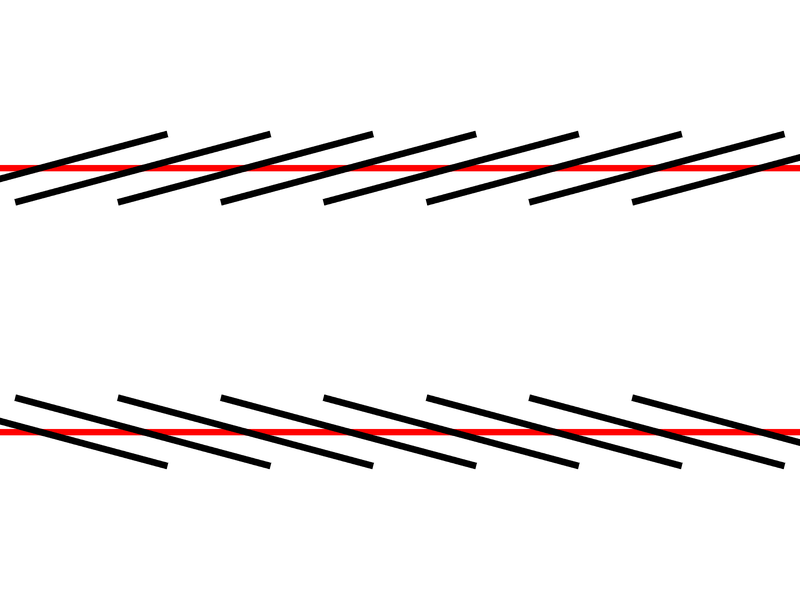

### Rod and Frame Illusion

The [**Rod and frame
illusion**](https://en.wikipedia.org/wiki/Rod_and_frame_test#Rod_and_frame_illusion)
is an optical illusion causing the participant to perceive the rod to be
oriented congruent with the orientation of the frame.

``` python
parameters = ill.rodframe_parameters(illusion_strength=11)
ill.rodframe_image(parameters)
```

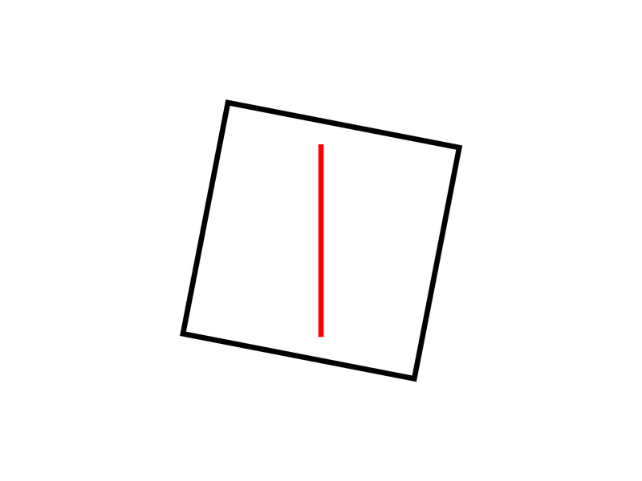

### Poggendorff Illusion

The [**Poggendorff
illusion**](https://en.wikipedia.org/wiki/Poggendorff_illusion) is an
optical illusion that involves the misperception of the position of one
segment of a transverse line that has been interrupted by the contour of
an intervening structure. It is named after Johann Christian Poggendorff
who discovered in Zöllner’s illusion after 1860. The magnitude of the
illusion depends on the properties of the obscuring pattern and the
nature of its borders.

``` python
parameters = ill.poggendorff_parameters(illusion_strength=-50)
ill.poggendorff_image(parameters)
```


### Simultaneous Contrast illusion

A neutral gray target will appear lighter or darker than it does in
isolation when compared to, respectively, a dark gray or light gray
target. [**Simultaneous
contrast**](https://en.wikipedia.org/wiki/Contrast_effect), identified
by Michel Eugène Chevreul, refers to the manner in which the colors of
two different objects affect each other.

In the image here, the two inner rectangles are exactly the same shade
of grey, but the upper one appears to be a lighter grey than the lower
one due to the background provided by the outer rectangles.

``` python
parameters = ill.contrast_parameters(illusion_strength=-50)
ill.contrast_image(parameters)
```


### White Illusion

[**White’s illusion**](https://en.wikipedia.org/wiki/White%27s_illusion)
is a brightness illusion in which rectangles of the same grey color are
perceived of different luminance depending on their background.

``` python
parameters = ill.white_parameters(illusion_strength=100)
ill.white_image(parameters)
```

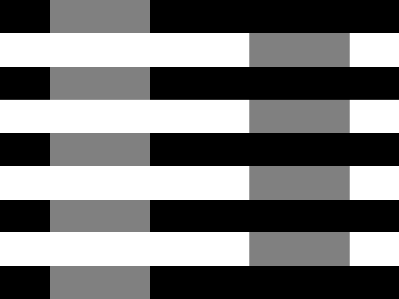

<!-- ### Chubb illusion -->
<!-- The [**Chubb illusion**](https://en.wikipedia.org/wiki/Chubb_illusion) is an optical illusion or error in visual perception in which the apparent contrast of an object varies substantially to most viewers depending on its relative contrast to the field on which it is displayed. -->
<!--  -->
<!-- - **TO DO** *(consider helping!)* -->

### Kanizsa Square

The **Kanizsa Square** is an [illusory
contour](https://en.wikipedia.org/wiki/Illusory_contours) illusion. See
[Keane et al.,
2019](https://www.ncbi.nlm.nih.gov/pmc/articles/PMC6667222/).


-   **TO DO** *(consider helping!)*

### Autostereograms

[Autostereograms](https://en.wikipedia.org/wiki/Autostereogram) are
images made of a pattern that is horizontally repeated (with slight
variations) which, when watched with the appropriate focus, will
generate an illusion of depth.

For instance, in the image below, the `autostereogram` automatically
adds a guide (you can disable it by setting `guide=False`), the two red
dots. Look at them and relax your eyes until you see a new red dot
between them two. Then, try focusing on this new red dot until it gets
very sharp and until your eyes stabilize. You should then be able to
perceive the letters **3D** as carved in the figure

It can take a bit of time to “get there”, but once you are used to it,
it’s a mind-blowing experience 🤯

``` python
ill.autostereogram(stimulus="3D", width=1600, height=900)
```

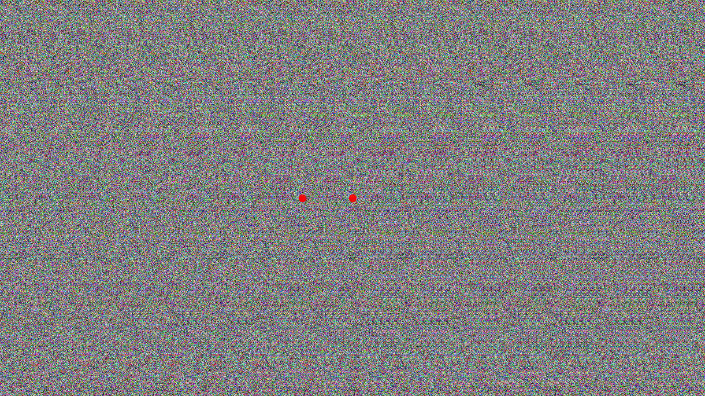

The function is highly customisable, and we can use a black and white
image as a **depth mask** (in this case, the [picture of a
skull](https://github.com/DominiqueMakowski/Pyllusion/docs/img/depthmask.png)
that you will see as emerging from the background), and customise the
pattern used by providing another function (here, the `image_circles()`
function to which we can provide additional arguments like `blackwhite`,
the number of circles `n`, their size range and their transparency with
`alpha`).


``` python
ill.autostereogram(stimulus="docs/img/depthmask.png",
                   pattern=ill.image_circles,
                   color="blackwhite",
                   alpha=0.75,
                   size_min=0.005,
                   size_max=0.03,
                   n=1000)
```

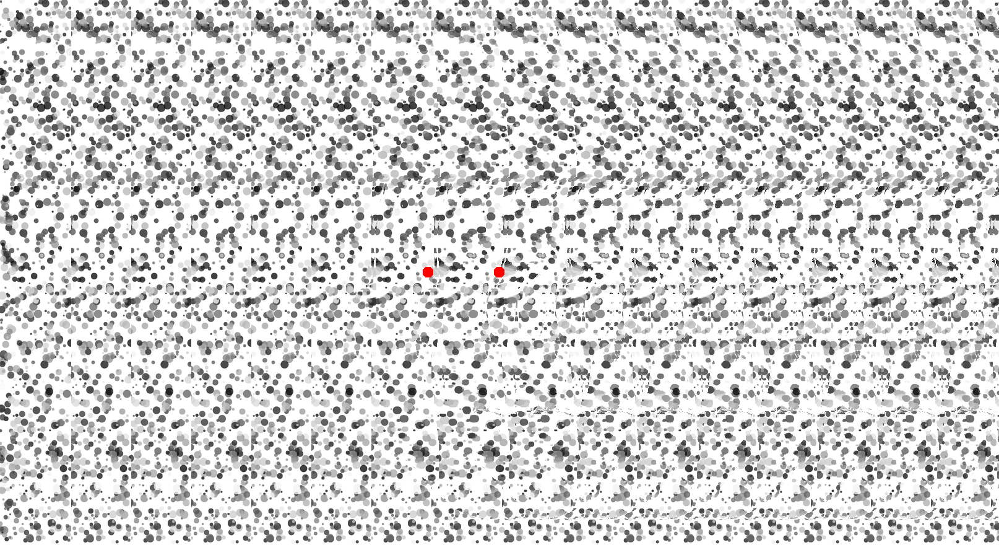

### Pareidolia

Pareidolia is the tendency to incorrectly perceive of a stimulus as an
object pattern or meaning known to the observer. [Liu et
al. (2014)](https://www.ncbi.nlm.nih.gov/pmc/articles/PMC3980010/?mod=article_inline),
in their study *“Seeing Jesus in toast”*, famously (the study got
awarded an Ignobel prize) investigated the correlates of face pareidolia
by blending images of faces with noise-like images.

Blending of images can be achieved:

``` python
ill.pareidolia(pattern="docs/img/snake.png", 
               n=[20, 300, 4000], 
               sd=[4, 2, 1], 
               weight=[3, 2, 1],
               alpha=80,
               blur=0.5)
```

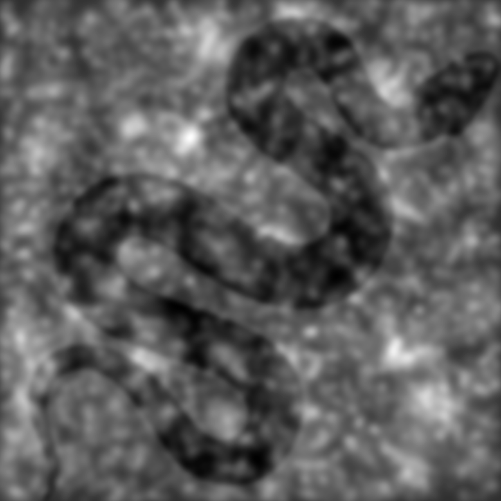

### Transparency From Motion (TFM)

In visual perception, the [**kinetic depth
effect**](https://en.wikipedia.org/wiki/Kinetic_depth_effect) refers to
the phenomenon whereby the three-dimensional structural form of an
object can be perceived when the object is moving (Wallach & O’Connell,
1953; [Mamassian & Wallace,
2010](https://jov.arvojournals.org/article.aspx?articleid=2191769)). One
of its derivative is the **Transparency-From-Motion** illusion,
consisting in the superposition of two dot clouds moving in different
directions that results in the perception of two transparent layers (See
; [Schütz,
2014](https://jov.arvojournals.org/article.aspx?articleid=2193903);
[Wexler et al.,
2015](https://www.pnas.org/content/pnas/112/48/14990.full.pdf); [Schütz
& Mamassian,
2016](https://jov.arvojournals.org/article.aspx?articleid=2548036) and
<http://lab-perception.org/demo/p/tfm> for a demo).

``` python
parameters = ill.motiontransparency_parameters(angle=45)
images = ill.motiontransparency_images(parameters)

ill.images_to_gif(images, path="Transparency_From_Motion.gif", fps=parameters["FPS"])
```

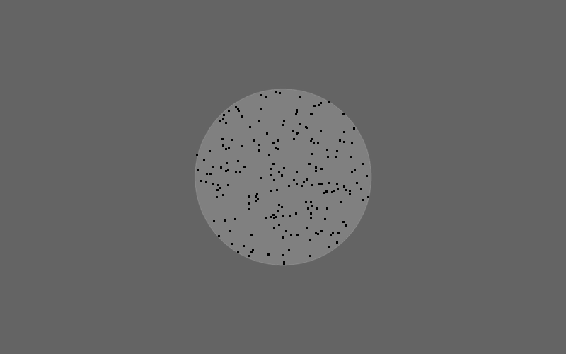

<!-- ### Pattern Detection in Motion  -->
<!-- - **TO DO** *(consider helping!)* -->

### Pinna illusion

See also [Zeljic et al.,
2021](https://www.sciencedirect.com/science/article/pii/S0278584620303717).

-   **TO DO** *(consider helping!)*


## References

Bertamini, M. (2017). [*Programming visual illusions for
everyone*](https://www.programmingvisualillusionsforeveryone.online).
Springer.
