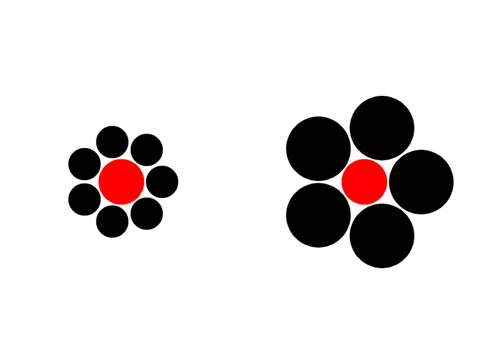

\justify

```{r r_setup, include = FALSE, warning=FALSE, message=FALSE}
library("papaja")
library("kableExtra")
options(knitr.kable.NA = 'None')

library(tidyverse)
library(easystats)

# Setup python - you need to change the path to your python distribution
library(reticulate)
# reticulate::use_python("C:/Users/Pham Thanh Tam/Desktop/WPy-3710b/python-3.7.1.amd64/")
matplotlib <- import("matplotlib")
matplotlib$use("Agg", force = TRUE)
```


# Visual Illusions

<!-- Intro about illusions -->

<!-- Example of psychological research using illusion -->

<!-- Aim of the software -->

<!-- From NEUROPSYDIA -->
<!-- Neuropsychology encompasses two intimately related aspects: experimental research and
clinical activity. Yet, the gap between these two facets has been severely increasing over
the last decades due to the developpement of new technological ressources employed in
research paradigms, often lacking portability to clinical practice. This gap restrains direct
results application and generalization from research to clinical practice, and vice versa.

Neuropsydia.py is a Python module that provides a high-level set of tools to quickly
and easily create computerized experiments, cognitive tests or questionnaires, offering the
possibility to heighten up the quality and accuracy of clinical neuropsychology. This free,
open-source solution allows neuropsychologists, psychologists and neuroscientists to build
sophisticated tasks and focus on what is important: the results and their interpretation.


Neuropsydia.py is based on Pygame and the SDL library, allowing maximum flexibility and compatibility accross platforms. Unlike other python-based experiment creation
modules, such as PyschoPy (Peirce 2007) or OpenSesame (Mathôt, Schreij, and Theeuwes
2012), it has no GUI, yet still being oriented toward non-programmers. Indeed, its API
is centered around a limited amount of functions with straighforward names such as
write, image, ask, scale or choice. This function-oriented philosophy (contrary to
class-oriented syntax such as the one used in Expyriment (Krause and Lindemann 2014))
ensures readability and understanding even for people with not much experience in programming.
Neuropsydia.py can be installed using pip from the Python Package Index 1. Source code
and issue tracker are available in Neuropsydia.py’s GitHub repository 2, as well as usage
examples 3 and a test script 4. Documentation, tutorials and examples are provided
through Readthedocs 5.--> 

This paper describes *Pyllusion*, a Python module providing a parametric framework for generating visual illusions in computerized neuropsychology and neuroscience experiments. It is designed for specific integration within the *psychopy* [@peirce2007psychopy] package for PsychoPy experiment creation.

*Pyllusion* encompasses several different illusions, including the Delboeuf illusion, Ebbinghaus illusion, Müller-Lyer illusion, Ponzo illusion, Vertical–horizontal illusion, Zöllner illusion, Rod and Frame illusion and Poggendorff illusion.


# Installing Pyllusion

*Pyllusion* is available on PyPI, a repository of software for the Python programming language and can be installed using pip (via '*pip install pyllusion*' command). 


# Examples of Features

In this section, we use two brief examples to demonstrate how *Pyllusion* functions can be used to generate optical illusions. 


## Illusion Display

*Pyllusion* encompasses a function-oriented philosophy based on the *psychopy* package. Each function is illusion-specific and hence, uniform function names (in the form `illusiontype_functiongoal()`) are used in the process of creating the illusion. While the functions can be incorporated within a PsychoPy builder, it can also be used without a GUI - the following example demonstrates the latter in generating a Delboeuf illusion.

Parameters specifying the illusion difficulty and strength are generated using `*_parameters()` before executing the display via `*_psychopy()`. 


```{python illusion display, include=TRUE, results="hide", eval=TRUE, echo = TRUE}
# Load packages
import pyllusion as ill
from psychopy import visual, event
  
# Create parameters  
parameters = ill.delboeuf_parameters(difficulty=2, illusion_strength=1)
    
# Initiate Window
window = visual.Window(size=[800, 600], fullscr=False,
                       screen=0, winType='pyglet', monitor='testMonitor',
                       allowGUI=False, color="white",
                       blendMode='avg', units='pix')

# Display illusion
ill.delboeuf_psychopy(window=window, parameters=parameters)
    
# Refresh and close window    
window.flip()
event.waitKeys()  # Press any key to close
window.close()
```

```{r include=TRUE, eval=TRUE, echo = FALSE, out.width="100%", fig.cap="Delboeuf Illusion generated by Pyllusion using `difficulty=2` and `illusion_strength=1` in `delboeuf_parameters()`."}
knitr::include_graphics("figures/example_delboeuf.PNG")
```

## Running a PsychoPy experiment using Pyllusion

This example demonstrates how *Pyllusion* can be easily integrated into PsychoPy. Here, a series of ebbinghaus illusions of varying illusion strengths is displayed consecutively, accompanied with an instructions message at the start of the experiment and an end message at the end of the experiment. Do note that the optical illusion will always be of different strengths everytime the example is run as the generated parameters are randomized in this example.


```{python psychopy experiment, include=TRUE, results="hide", eval=TRUE, echo = TRUE}
# Load packages
import pyllusion as ill
import numpy as np
from psychopy import visual, event, gui
import wx

# Set up GUI
gui = gui.Dlg()
gui.addField("Subject ID:")
gui.addField("Experiment Title:")

gui.show()

# Initiate window
app = wx.App(False)
width = wx.GetDisplaySize()[0]
height = wx.GetDisplaySize()[1]

window = visual.Window(size=[width, height], fullscr=True,
                       screen=0, winType='pyglet', monitor='testMonitor',
                       allowGUI=False, color="white",
                       blendMode='avg', units='pix')

# Start instructions
instructions = visual.TextStim(win=window, wrapWidth=350, color="black")

instructions.text = """
You will now see some visual illusions.\n
Press any key to begin.
"""
instructions.draw()
window.flip()
event.waitKeys()

# Initiate list of randomized parameters to prepare for displaying illusion  
difficulty = np.random.randint(low=1, high=6, size=(5,))
strength = np.random.randint(low=1, high=6, size=(5,))
parameters_list = []

for diff, strg in zip(difficulty, strength):
    parameters = ill.ebbinghaus_parameters(difficulty=diff, illusion_strength=strg)
    parameters_list.append(parameters)

for param in parameters_list:  # Loop illusions to display
    ill.ebbinghaus_psychopy(window=window, parameters=param)
    window.flip()
    event.waitKeys()  # Press any key to move on

# End message
message_end = visual.TextStim(win=window, wrapWidth=350, color="black")

message_end.text = """
You have now come to the end of the experiment.
Press any key to end.
"""
message_end.draw()

window.flip()
event.waitKeys()
window.close()

```


```{r include=TRUE, eval=TRUE, echo = FALSE, out.width="100%", fig.cap="Ebbinghaus Illusion generated by Pyllusion using `difficulty=0` and `illusion_strength=2` in `ebbinghaus_parameters()`."}

```


# Conflict of Interest

The authors declare that the research was conducted in the absence of commercial or financial relationships that could constitute a conflict of interest.

# Licensing and Availability

*Pyllusion*'s source code and issue tracker are available at its GitHub repository (https://github.com/RealityBending/Pyllusion) and the package is licensed under the MIT License. It aims to be a project for facilitating the running of experiments in PsychoPy and is open for further collaboration in view of improvements in features and bug fixes.

# Acknowledgements

We would like to thank ...

\newpage

# References
```{r create_r-references}
r_refs(file = "bibliography.bib")
```

\begingroup
\setlength{\parindent}{-0.5in}
\setlength{\leftskip}{0.5in}

<div id = "refs"></div>
\endgroup
