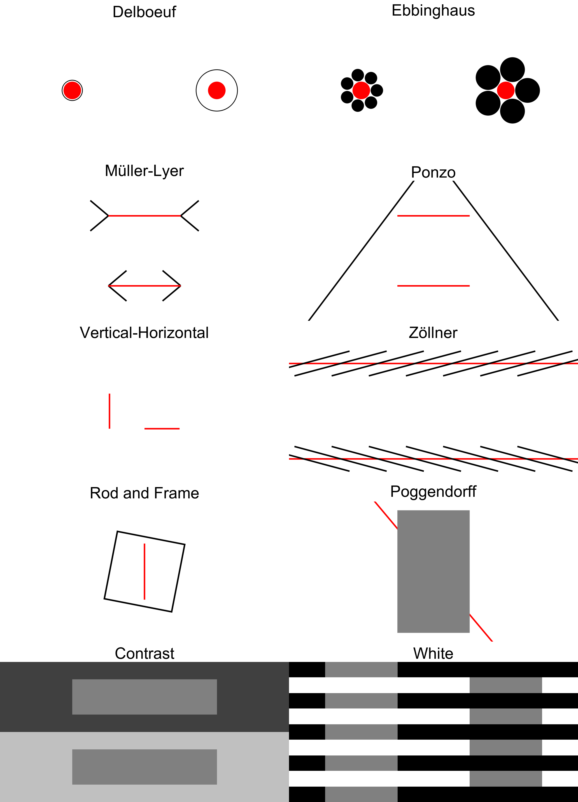
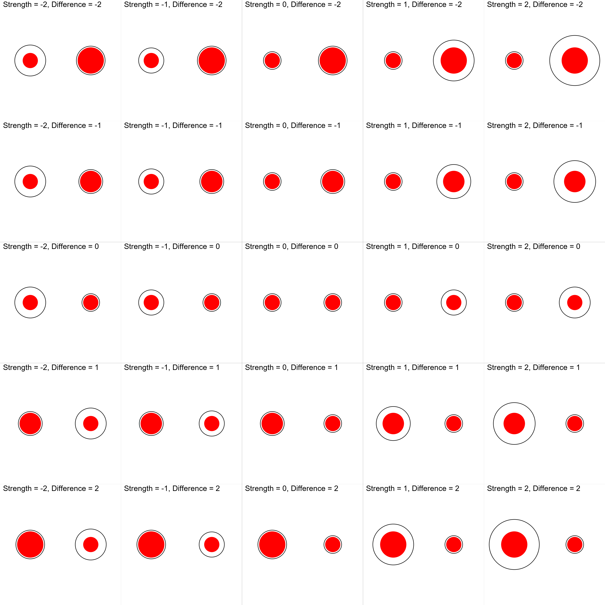

\justify

```{r r_setup, include = FALSE, warning=FALSE, message=FALSE}
library("papaja")
# library("kableExtra")
# options(knitr.kable.NA = 'None')

# library(tidyverse)
# library(easystats)

# Setup python - you need to change the path to your python distribution
# library(reticulate)
# reticulate::use_python("C:/Users/Pham Thanh Tam/Desktop/WPy-3710b/python-3.7.1.amd64/")
# reticulate::use_python("D:/Downloads/WPy64-3902/python-3.9.0.amd64/")
# reticulate::use_python("C:/Users/Dom/Desktop/WPy64-3860/python-3.8.6.amd64/")
# reticulate::use_python("C:/Users/Zen Juen/Downloads/WPy64-3850/python-3.8.5.amd64/")


# matplotlib <- import("matplotlib")
# matplotlib$use("Agg", force = TRUE)
```


# Introduction


Visual illusions have been observed for hundreds of years [@LuckieshVisualIllusions1965], many of which were described in print by @helmholtz1856handbuch in 1856 [@helmholtz1856handbuch]. In general terms, a visual illusion can be thought of as the inaccurate perception of a visual stimulus or a given attribute, be it geometrical (size, shape, or angle), or another property such as colour [@muller1896lehre; @howe2005muller; @delboeuf1893nouvelle; @ebbinghaus1902grundzuge; @roberts2005roles; @adelson200024]. Often, an illusory perception resists 'correction' in perception even after an observer has been made aware of the misperception. Novel examples of illusions are still observed and have even cropped up on social media platforms, a famous example being 'The Dress Illusion' (see **Fig. 1**) as discussed by @schlaffke2015brain. See @ninio2014geometrical, @LuckieshVisualIllusions1965, and @robinson1972psychology for extensive collections of visual illusions.

```{r include=TRUE, eval=TRUE, echo = FALSE, out.width="100%", fig.cap="The internet-famous 'Dress illusion' image (on the left), which some people perceive as white and yellow *vs.* black and blue. It is thought to illustrate how perceptual priors (i.e., expectations regarding the lighting conditions) can bias our conscious representation of an object (see visual explanation - from Wikipedia - on the right)."}
knitr::include_graphics("figure1.png")
```


Entertainment value aside, illusions can serve a more practical utility. Visual illusions have helped scientists understand the architecture of the eye and its relationship with processes and structures involved further up stream in the brain, the dynamic interaction of these processes, and visual coding in the brain in general [@carbon2014understanding; @forte2005inter; @clifford2002perceptual]. Illusions such as the blind-spot or those associated with colour perception, orientation perception, and motion perception, have all been informative of neuronal activity/processes both at the level of the eye and the brain via the measurement of associated illusions  [@durgin1995filling; @webster1996human; @witkin1948studies; @mackay1957moving; @Holland1965; @curran2009hierarchy]. Visual illusions, and perceptual illusions more generally, are a powerful tool in human perception and brain research, which in turn can inform artificial cognitive systems design considerations [@carbon2014understanding; @boyce2020optimality].


The use of visual illusions to demonstrate contextual influences on visual perception [@corbett2006observer; @chen2015contextual; @roberts2005roles] has underlined its potential relevance in clinical contexts, for instance as markers or tools to investigate typical integration processes in schizophrenia [@clifford2014tilt; @thakkar2020stronger; @palmer2018perceptual]. Indeed, several studies have demonstrated a diminished susceptibility to visual illusions amongst patients with schizophrenia relative to healthy controls [@notredame2014visual; @king2017review]. People with schizotypal personality traits perform significantly better at making accurate judgements of contrasts under contextual suppression [@dakin2005weak], are less prone to the perception of illusory motion [@crawford2010perception], and are less susceptible to visual size illusions [@uhlhaas2004evidence]. Researchers often contrast this evidence of preserved perceptual performance against a backdrop of poor cognitive abilities [i.e., working memory, object naming, concentration; @liddle1987schizophrenic] amongst schizophrenics, contending that the disorder is characterized by a specific processing abnormality rather than a generalized cognitive impairment [@dakin2005weak; @tibber2013visual]. As different illusions could tap on distinct neurocognitive processes, researchers have also been able to further characterize specific perceptual anomalies that occur in schizophrenia. For example, while schizophrenic patients show a heightened resistance to contrast illusions, they are indistinguishable from healthy controls in judging brightness illusions [@tibber2013visual], arguing against a broad deficit in low-level perceptual integration since not all illusions are affected. Other studies emphasize the role of high-level perceptual deficits in schizophrenia [e.g., problems in contextual processing that manifest as greater resistance to the Ebbinghaus illusion; @massaro1971judgmental; @uhlhaas2006theory], but the lack of consistency in the tasks' methodologies has posed a significant challenge to advancing our theoretical understanding of schizophrenia [@king2017review]. Specifically, the finding of an increased perceptual accuracy towards high-level illusions has failed to replicate in several other studies [e.g., @parnas2001visual; @yang2013visual; @spencer2014oscillatory], and other kinds of illusions (e.g., the Poggendorff illusion) have simply not been sufficiently tested [@kantrowitz2009seeing].

Individuals with autistic spectrum disorder (ASD) is another clinical group that demonstrates a similar immunity to perceptual biases, supporting the existence of difficulties in global processing and, conversely, an enhanced preference for idiosyncratic and detailed information [@happe1996studying]. Hence, individuals with ASD appear as protected against the contextual influences of illusions in biasing perception, allowing them to perceive elements accurately in a local fashion [referred to as a 'weak central coherence'; @mitchell2010susceptibility; @walter2009specific; @gori2016visual]. Some work has also been successful in delineating the underlying cognitive mechanisms employed by different illusions, revealing that autistic traits in a typical population were related to greater resistance to the Müller-Lyer illusion, but not the Ebbinghaus or Ponzo illusions [@chouinard2013global]. However, findings of illusion resistance amongst ASD face similar low replicability rates as with the literature on schizophrenia, even when the same illusion tasks are used [@ropar1999individuals; @hoy2004weak]. These mixed findings are attributed not only to the heterogenous nature of ASD as a clinical population, but also to the large variability in experimental instructions (e.g., asking whether lines "looked the same length" vs. "were the same length", see @happe2006weak) and the subsequent understanding of the task requirements [@chouinard2013global].

<!--Performance on visual illusion tasks has been shown to be a surrogate proxy of visual hallucinations, moving diagnosis criterion away from the reliance of family and self-reports, such as being able to differentiate dementia with Lewy bodies from both Alzheimer's Disease and healthy controls [@uchiyama2012pareidolias]. Specifically, the former show a pronounced tendency to produce pareidolic illusions, which are complex visual illusions that result in the perception of meaningful objects (e.g., faces, animals) from ambiguous forms [@uchiyama2012pareidolias; @mamiya2016pareidolia].-->

In summary, these studies suggest that illusions, rather than being mere perceptual artifacts, engage specific neurocognitive processes involved in important higher order functions and neuropsychiatric disorders. A common approach to explain illusory phenomena is using the Predictive Coding framework [@friston2009predictive], which posits that illusory perception typically arises because of a strong systematic bias for prior beliefs (top-down influence) that are mismatched with actual sensory evidence, causing the generation of an objectively wrong but more plausible percept (i.e., two objectively equivalent-sized circles being interpreted as different sizes because of their surrounding context) [@notredame2014visual]. In the case of schizophrenia and also in other states of psychosis, a greater resistance to visual illusions is then interpreted as a product of reduced adaptive top-down influence [@schneider2002reduced; @koethe2009binocular] and an over-reliance on sensory evidence (bottom-up processes) in making perceptual judgements [@dima2010impaired]. While evidence from visual illusions research has garnered substantial support for the predictive coding account, helping to underscore the neurocomputational mechanisms that are fundamental to psychiatric and psychological disorders [@sterzer2018predictive], there are contradictory findings that fail to be integrated within this approach. The lack of consistency and replicability in experimental designs using illusions-based stimuli appear to be one of the main reasons for slowing the progress in the field.


Despite the relevance of visual illusions in psychology and neuroscience, the field of illusion research lacks a dedicated software to generate and report the stimuli, in order for them to be reproduced and re-used by other researchers and studies. As several reviews have highlighted [e.g., @gori2016visual], the lack of a validated paradigm and the improper measurement of visual illusion sensitivity (especially amongst individuals with communication problems) may be preventing progress in understanding the distinct mechanisms that underlie psychopathology and other fields alike. This is particularly problematic in the context of the replicability and reproducibility issues recently outlined in psychological science [@topalidou2015long; @open2015estimating; @milkowski2018replicability; @maizey2019barriers]. Our software, **Pyllusion**, aims at addressing this gap by proposing and implementing a parametric framework for illusions generation.


# A Parametric Framework for Illusion Research


The core idea of the "parametric" approach proposed here and implemented in **Pyllusion** is to dissociate the parameters of an illusion from its rendered output. For instance, the Ponzo illusion (see **Fig. 2**) can be described in terms of properties of the "distractor" lines (which create the illusion), such as the angle (related to the illusion strength), the color, width, etc. and properties of the "target" lines (which are affected by the illusion), such as the size of the smallest line, the objective difference of the ratio of their lengths, or their color, width, etc. This set of parameters can then be rendered in different formats with further format-specific characteristics (in the case of images, the image size, ratio, resolution, compression, etc.).


```{r include=TRUE, eval=TRUE, echo = FALSE, out.width="100%", fig.cap="The parametric framework for illusions originally implemented in **Pyllusion** aims at dissociating the *parametric* representation of an illusion (on the left) from its *rendered* representation, in this case as an image of the Ponzo illusion (on the right). In technical terms, an *illusion strength* of -15 represents a 15 degree tilt of the vertical lines (black distractor lines); an objective *difference* of 0.3 represents a 30% length difference of the upper and lower horizontal lines (red target lines) where the *size* of the shorter horizontal line is 0.5."}
knitr::include_graphics("figure2.png")
```


This essentially allows researchers to describe, manipulate, process and share their stimuli in a concise yet consistent way. For instance, researchers could report a *"linear modulation of the illusion strength between -15 and 15, resulting in a reduced reaction time of..."*, providing details about the remaining parameters, as well as the Python code used to fully reproduce their stimuli.

Moreover, this parametric approach is scalable and works well with different kinds of illusions, as demonstrated in the software. Indeed, many visual illusions (especially the classical one) appears to have relatively similar parameters (such as a feature - like the angle or the size of some shapes - related to the strength of the illusion, or the color of the "target" objects), which in turn allows for a consistent programming interface (API).

Interestingly, in most of the visual illusions, the strength of the illusion can be dissociated from the actual "difference" (which is impacted by the illusion). For instance, in the Müller-Lyer illusion (see **Fig. 2**), the difference between the two horizontal segments can be modulated orthogonally from the angle of the "distractors" arrows. Allowing researchers to easily manipulate these parameters opens the door for potentially interesting paradigms and experiments. In the following section, we will describe with concrete examples how we operationalized such a parametric approach in the **Pyllusion** software.


<!-- parametric representation -->
<!-- example, delboeuf parameters, show output of dictionary parameters. pass dict values into another function to generate either image or psychopy object -->


# Pyllusion


It is not the first time that Python, illusions and cognitive science are brought together. In his book, *"Programming visual illusions for everyone"*, @bertamini2017programming describes how to use *PsychoPy* to generate famous illusions. That said, although being a fantastic tool and resource for researchers and anybody interested in illusions, it is presented as a fun introduction to programming and to Python, rather than a dedicated software for illusions *per se*.

**Pyllusion** is an open-source package to programmatically generate illusions written in Python 3 [@python3], which means that its users benefit from a large number of learning resources and a vibrant community. However, although being a programming-based tool, users not familiar with Python or other languages can easily use it as well, as it requires minimal programming skills (one can essentially copy the few necessary lines from the documentation and tweak the explicitly-named parameters). This makes it a very flexible tool; advanced users can incorporate **Pyllusion** in their scripts or experiments (for instance, to generate illusions "on the fly" based on the input of the user), whereas novice users can simply copy the minimal code to pre-generate and save the illusions as images.


The source code is available under the MIT license on GitHub (*https://github.com/RealityBending/Pyllusion/*). Its documentation (*https://realitybending.github.io/Pyllusion/*) is automatically built and rendered from the code and includes guides for installation, a description of the package's functions, as well as examples of use. Finally, the issue tracker on GitHub offers a convenient and public forum that allows users to report bugs, get help and gain insight into the development of the package. Additionally, the repository leverages a comprehensive test suite (using *pytest*) and continuous integration (using Travis-CI and GitHub actions) to ensure software stability and quality. The test coverage and build status can transparently be tracked via the GitHub repository. Thanks to its collaborative and open development, *Pyllusion* can continuously evolve, adapt, and integrate new functionalities to meet the needs of the community.

<!-- Installation -->
**Pyllusion** is available on PyPI, the main repository of software for Python and can thus be installed by running the command `pip install Pyllusion`. Once the software is installed, it must be loaded in Python scripts with `import pyllusion`. Once the package is loaded, two steps are further required to generate the illusions, 1) specifying the parameters and 2) rendering the output accordingly.

We will use the Delboeuf illusion in the hands-on example shown below. However, the same workflow applies to other the other illusions supported by ***Pyllusion***, including the Ebbinghaus illusion, the Müller-Lyer illusion, the Ponzo illusion, the Zöllner illusion, the Rod and Frame illusion, the Poggendorff illusion and more (see **Fig. 3**, as well as the full list with examples on the [**readme**](https://github.com/RealityBending/Pyllusion) page of the repository).

```{r include=TRUE, eval=TRUE, echo = FALSE, out.width="100%", fig.cap="Different historical visual illusions currently supported by ***Pyllusion***. These can all be generated using the parametric approach described in this paper, allowing for fully reproducible studies."}

```


## Step 1: Parameters

The parameters for each illusion can be generated using the `IllusionName_parameters()` function. Many optional arguments are available for modifying, of which the description and default values can be find in the API documentation (https://realitybending.github.io/Pyllusion/functions.html). In the example below, we specify the `illusion_strength` argument, and the function will compute all of the remaining parameters accordingly.


```python
# Load package
import pyllusion

# Create parameters
parameters = pyllusion.delboeuf_parameters(illusion_strength=2)

# Visualize parameters
print(parameters)
```

```python
{'Difference': 0,
 'Size_Inner_Left': 0.25,
 'Size_Inner_Right': 0.25,
 'Size_Inner_Difference': 0.0,
 'Illusion_Strength': 2,u
 'Size_Outer_Left': 0.3,
 'Size_Outer_Right': 0.52,
 'Distance_Centers': 1,
 'Distance_Edges_Outer': 0.59,
 'Position_Left': -0.5,
 'Position_Right': 0.5,
 ...}
```

As one can see, the output of this function is a basic Python dictionary (as denoted by the curly brackets), which makes it easy to further process, modify, share, store or investigate. This "container" object stores the values for a large number of parameters, such as the size of each (inner and outer) circles, the distance between the centers and edges of the circles, their position, etc.), and is passed to a "rendering" function which converts this set of parameters into the final output.


Note the two main parameters, `illusion_strength`, and `difference`, have fairly generic names. For instance, in the Ponzo illusion, a less abstract names for these arguments could have been `difference_size_outer_circles` and `difference_size_inner_circles`). Indeed, the meaning of these parameters depends on the nature of the illusion. For instance, while `illusion_strength` currently refers to the  the area of the outer circles in the Delboeuf illusion, it refers to the angle of the non-horizontal lines in the Ponzo illusion.

Conceptually, this term represents the strength of the surrounding context in achieving a biased illusory perception of the relative target features (see **Fig. 3**). The decision of unifying the "illusion strength" parameter under the same name was further motivated by the aim of having a consistent naming scheme for the API. This means that users can experiment with new illusions by modulating the illusion strength, without the need of learning what is the actual physical parameter (e.g., "angle of the distractor lines") driving the illusion.

<!--  -->


## Step 2: Rendering

This dictionary, containing the parameters of the illusion, can then be passed to a "rendering" function, which actually draws (or displays) the illusion according to the specifications. Render-specific arguments are available at this stage, such as the dimensions of the image. Two output-engines are currently supported, images [in any format thanks to the PIL Python library for image processing; @clark2015pillow], or as *PsychoPy* stimuli [@peirce2007psychopy], one of the most popular psychological experiments software.


<!-- pass parameters into an output generator (as images or psychopy objects, psychopy being the most common experimentation software in psychology) -->
<!-- two engines available in pyllusion as of now -->


### Images

Each function is illusion-specific and hence, uniform function names (in the form `IllusionName_FunctionGoal()`) are used in the process of creating the illusion. Parameters are computed using `*_parameters()` (the asterisk representing the illusion name), and images can be generated via `*_image()` (or similarly, `*_psychopy()`, as we will see later).


The following Python code shows the full and reproducible code to generate a PNG image with a Delboeuf illusion. However, note that the parameters generation and the rendering have been dissociated for didactic reasons. In practice, the arguments related to the parameters of the illusion can be passed directly to the rendering function, which will automatically compute the parameters if no dictionary is passed. Similarly, the saving step can be done directly by adding `.save()` at the end of the the `*_image()` function, which reduces the amount of Python lines to one.


```python
# Load package
import pyllusion as ill

# Create parameters
parameters = ill.delboeuf_parameters(illusion_strength=1, difference=2)

# Generate image from parameters
image = ill.delboeuf_image(parameters, height=600, width=800)

# Save it
image.save("my_illusion.png")
```

Images can be easily post-processed using the the PIL library. For instance, with just a few lines, one can loop through different combinations of parameters, generate illusions, add text on them, and collate together in a mosaic, as can be seen in **Fig. 4**.


```{r include=TRUE, eval=TRUE, echo = FALSE, out.width="100%", fig.cap="Different combinations of illusion strength and objective difference between the two target stimuli (the area of the red circles) for the Delboeuf illusion. The vertical central column shows different magnitudes of difference in both directions with no illusion, whereas the horizontal central row shows different magnitudes of illusion strength when the targets are of identical sizes. By using negative or positive values for the illusion strength, one can generate congruent or incongruent illusions (that reinforce or attenuate the actual difference respectively)."}

```


<!--  -->


### PsychoPy

As illusions are heavily used in experimental psychology, we designed ***Pyllusion*** so that it is directly usable within *PsychoPy* [@peirce2007psychopy] experiments. *PsychoPy* is an open-source, free and Python-based package for experiments creation, recognized for its timing accuracy [@bridges2020timing] and its GUI (the "builder"), thereby allowing users who are not familiar with code to easily build experiments.

The *PsychoPy* "builder" interface allows for code components to be flexibly added, which makes it convenient to insert the few lines necessary for displaying illusions. However, using the programming interface of *PsychoPy* (which underlies the graphical interface) reveals how seamless the integration with ***Pyllusion*** can be. The following code is a minimal example demonstrating how to use a Delboeuf illusion within a *PsychoPy* workflow. Running it opens a new window, displays the illusion in it, and then closes it once an input (a key press) is detected.


```python
# Load packages
import pyllusion as ill
from psychopy import visual, event

# Create parameters
parameters = ill.delboeuf_parameters(illusion_strength=1, difference=2)

# Initiate Window
window = visual.Window(size=[800, 600], winType='pygame', color='white')

# Display illusion
ill.delboeuf_psychopy(window=window, parameters=parameters)

# Refresh and close window
window.flip()
event.waitKeys()  # Press any key to close
window.close()
```

This native integration with *PsychoPy* could appear as somewhat redundant and unnecessary, as one could pre-generate all the illusions as images, and simply load them in *PsychoPy* as images, instead of generating them from scratches using *PsychoPy*'s drawing functionalities. However, this direct integration in experiment building software has multiple benefits, such as avoiding the storage of heavy images (resulting in lighter experiments that can be uploaded and stored online), avoiding issues of image scaling and resolution on different screens, and allowing "on-the-fly" generation of stimuli, which opens the doors for novel adaptive paradigms where the modulation of illusions crucially depends on the participant's input.


# Future Plans and Developments

<!-- Open source -->
Being an open-source software, **Pyllusion** will continue to grow and evolve based on the community's input. While the direction and state of the package in the long term can be hard to predict, several short term goals can be mentioned.

<!-- Add more illusions -->
The initial release of ***Pyllusion*** focuses on a set of classical, well-described, visual illusions, as they are the most commonly used (for historical reasons mainly, as well as for their relative simplicity). That said, the number of existing illusions is virtually infinite [and great advances are made to generate new ones using machine learning; @watanabe2018illusory]. Thus, new illusions, as well as new illusion types (e.g., movement-based using GIF or video formats, or auditory illusions using sounds and music) could be added in the future. Due to the open and collaborative nature of the software, these evolutions will be driven by the needs of the community, ensuring that ***Pyllusion*** remains cutting-edge, adaptable and useful to address future issues.

<!-- Add more engines -->
Adding new illusions refers mostly to implementing an algorithm to conceptualise and essentialize them as sets of parameters, which is by design independent from their rendering. However, more rendering engines could be added down the road. For instance, one of the first milestones could take the form of an integration with other Python-based experiment building software, such as *OpenSesame* [@mathot2012opensesame] or *Neuropsydia* [@makowski2017neuropsydia]. Additionally, a conversion to other languages could also be an interesting feature, especially *JavaScript*, as this would allow a closer integration with web browser apps [and online experiments software, such as *jsPsych*; @de2016psychophysics; or *lab.js* ; @henninger2020labjs].

<!-- Experiments & validation -->
Finally, we look forward to the creation of studies that would investigate how, for each illusion, the modulation of the parameters affect behaviour and the conscious perception of neural processing. This would in turn allow for a better understanding of the commonalities and differences between these fascinating stimuli. As such, we hope that our tool contributes to the development of a strong axis that will unite the community working with illusions to push the field forward.


# Acknowledgements

We would like to thank Prof. Mahamaya for her insights regarding illusions.


\newpage

# References
```{r create_r-references}
r_refs(file = "paper.bib")
```

\begingroup
\setlength{\parindent}{-0.5in}
\setlength{\leftskip}{0.5in}

<div id = "refs"></div>
\endgroup
