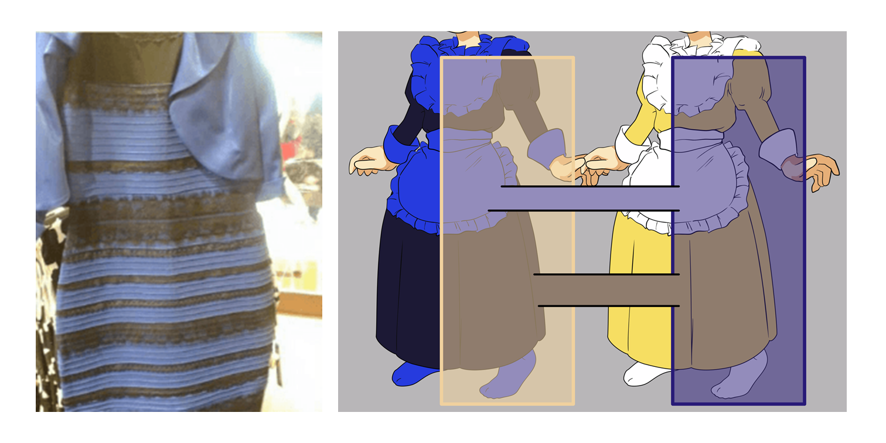

[? - Perception](https://journals.sagepub.com/home/pec)
[2.45 - Journal of Experimental Psychology: Human Perception and Performance](https://www.apa.org/pubs/journals/xhp/)
[1.893 - Attention, Perception, & Psychophysics](https://www.springer.com/journal/13414)
[? - Art \& Perception](https://brill.com/view/journals/artp/artp-overview.xml)
[? - Journal of Vision](https://jov.arvojournals.org/)
[1.102 - Visual Cognition](https://www.tandfonline.com/toc/pvis20/current)
[2.61 - Vision Research](https://www.sciencedirect.com/journal/vision-research)
[3 - Visual Neuroscience](https://www.cambridge.org/core/journals/visual-neuroscience)


Visual illusions are fascinating phenomena that have been used and studied by artists and scientists for centuries, leading to important discoveries about the neurocognitive underpinnings of perception and consciousness. Surprisingly, despite their strong historical importance as psychological stimuli, there is no dedicated software, nor consistent approach, to generate illusions and describe them. Instead, scientists have to craft them by hand in an idiosyncratic fashion, or use pre-made images not tailored for the specific needs of their studies. This, in turns, hinders the reproducibility of illusion-based research and narrows its possibilities and applications. With the aim of addressing that gap, ***Pyllusion*** offers a framework to manipulate and generate illusions in a systematic way, compatible with different output formats such as image files (.png, .jpg, .tiff, etc.) or *PsychoPy* [@peirce2007psychopy] stimuli.


# Introduction


Visual illusions have been observed for hundreds of years [@LuckieshVisualIllusions1965], many of which were described in print by Helmholtz (1856) in 1856 [@robinson1972psychology]. In general terms, a visual illusion can be thought of as the inaccurate perception of a visual stimulus or a given attribute, be it geometrical (size, shape, or angle), or another property such as colour [@muller1896lehre, @howe2005muller, @delboeuf1893nouvelle, @ebbinghaus1902grundzuge, @roberts2005roles, @adelson200024]. Often an illusory perception resists 'correction' in perception even after an observer has been made aware of the misperception. Novel illusions are still observed and have even cropped up on social media platforms, a famous example being 'The Dress Illusion' as discussed by Schlaffke et al. (2015). See Ninio (2014), Luckiesh (1965), and Robinson (1972) for extensive collections of visual illusions.

**FIX CITATIONS HERE** 

Entertainment value aside, illusions can serve a more practical utility. Visual illusions have helped scientists understand the architecture of the eye and its relationship with processes and structures involved further up stream in the brain, the dynamic interaction of these processes, and visual coding in the brain in general [@carbon2014understanding, @forte2005inter, @clifford2002perceptual]. Illusions such as the blind-spot or those associated with colour perception, orientation perception, and motion perception, have all been informative of neuronal activity/processes both at the level of the eye and the brain via the measurement of associated illusions  [@durgin1995filling, @webster1996human, @witkin1948studies, @mackay1957moving, @Holland1965, @curran2009hierarchy]. Indeed, visual illusions also have the potential as clinical tools, such as being markers of, or being used to investigate typical integration processes through the lens of, schizophrenia [@clifford2014tilt, @thakkar2020stronger, @palmer2018perceptual] and have been used to demonstrate vestibular and contextual influences on visual perception [@corbett2006observer, @chen2015contextual, @roberts2005roles]. Visual illusions, and perceptual illusions more generally, are a powerful tool in human perception and brain research, which in turn can inform artificial cognitive systems design considerations [@carbon2014understanding, @boyce2020optimality].


- **Add review on psychopathology**


Despite its relevance to psychology and neuroscience, the field of illusion research lacks a dedicated software to generate and report the stimuli, in order for them to be reproduced and re-used by other researchers and studies. This is particularly problematic in the context of the replicability and reproducibility issues recently outlined in psychological science [@Chambers2014, @Etz2016, @Szucs2016]. Our software, **Pyllusion**, aims at addressing this gap by proposing and implementing a parametric framework for illusions generation.


# A Parametric Framework for Illusion Research





The core idea of this "parametric" approach is to dissociate the *parameters* of an illusion from its *rendered* output. 


For instance, the Ponzo illusion (see **Fig. 1**) can be described in terms of properties of the "distractor" lines (what creates the illusion), such as the *angle* (which are related to the illusion strength), the *color*, *width*, etc. and properties of the "target" lines (what is affected by the illusion), such as the *size* of the smallest line, the objective *difference* of ratio, the *color*, *width*, etc. This set of parameters can then be rendered in different formats with further format-specific characteristics (in the case of images, the image size, ratio, resolution, compression, etc.).

This essentially allows researchers to describe, manipulate, process and share their stimuli in a minimal yet consistent

This parametric approach is scalable and appears to work well with different kinds of illusions. Similar parameters allowing for a consistent API.

The parametric approach implemented in this software proposes to **describe illusions using a set of parameters**, such as for instance the *difference* and *illusion strength*. These two parameters can be modulated to independently impact either the objective difference of the core components of the illusion (e.g., the difference between the two segments in the [Müller-Lyer](#müller-lyer-illusion-illusion) illusion) or the intensity of the illusion effect (e.g., the angle of the "distractors" arrows). 


The "parametric framework" for illusions originally implemented in **Pyllusion** aims at dissociating 

parametric representation


<!-- example, delboeuf parameters, show output of dictionary parameters. pass dict values into another function to generate either image or psychopy object -->


# Pyllusion
<!-- One paragraph about software stuff: where to find documentation, CI, link of repo etc. -->

*Pyllusion* is a Python module providing a parametric framework for generating visual illusions in computerized neuropsychology and neuroscience experiments. 
*Pyllusion* encompasses several different illusions, including the Delboeuf illusion, Ebbinghaus illusion, Müller-Lyer illusion, Ponzo illusion, Vertical–horizontal illusion, Zöllner illusion, Rod and Frame illusion and Poggendorff illusion.

*Pyllusion* is available on PyPI, a repository of software for the Python programming language and can be installed using pip.

```
pip install pyllusion
```

And loaded with a Python script with:

```python
import pyllusion as ill
```


## Output

<!-- pass parameters into an output generator (as images or psychopy objects, psychopy being the most common experimentation software in psychology) -->
<!-- two engines available in pyllusion as of now -->

*Pyllusion* encompasses a function-oriented philosophy based on the *psychopy* package. Each function is illusion-specific and hence, uniform function names (in the form `illusiontype_functiongoal()`) are used in the process of creating the illusion.
While the functions can be incorporated within a PsychoPy builder, it can also be used without a GUI - the following example demonstrates the latter in generating a Delboeuf illusion.
Parameters specifying the illusion difficulty and strength are generated using `*_parameters()` before executing the display via `*_psychopy()`.


### Images

```python

# Load package
import pyllusion as ill

# Create parameters
parameters = ill.delboeuf_parameters(difficulty=2, illusion_strength=1)

# Generate image from parameters
ill.delboeuf_image(parameters)
```


### PsychoPy

It is designed for specific integration within the *psychopy* [@peirce2007psychopy] package for PsychoPy experiment creation.


```python
# Load packages
import pyllusion as ill
from psychopy import visual, event

# Create parameters
parameters = ill.delboeuf_parameters(difficulty=2, illusion_strength=1)

# Initiate Window
window = visual.Window(size=[800, 600], fullscr=False,
                       screen=0, winType='pyglet', monitor='testMonitor',
                       allowGUI=False, color="white",
                       blendMode='avg', units='pix')

# Generate psychopy object from parameters
ill.delboeuf_psychopy(window=window, parameters=parameters)

# Refresh and close window
window.flip()
event.waitKeys()  # Press any key to close
window.close()
```


# Future Plans and Developments

*Pyllusion*'s source code and issue tracker are available at its GitHub repository (https://github.com/RealityBending/Pyllusion) and the package is licensed under the MIT License.
It aims to be a project for facilitating the running of experiments in PsychoPy and is open for further collaboration in view of improvements in features and bug fixes.
<!--talk more about open science. plan to add more illusions and support to more output engines eg., neuropsydia, opensesame -->


Validation to see how the illusion strength values affect the perception.

While illusions are of number (there are even machine learning algorithms generating visual illusions [REF]), a subset of them is commonly used (for historical reasons mainly, as well as for their relative simplicity). This set of classical, well-described, illusions, such as the Delboeuf, the Ponzo [ETC], is the primary focus of ***Pyllusion***. That said, due to the open and collaborative nature of the software, new illusions can always be added depending on the needs of the community.


# Acknowledgements

We would like to thank ...

# References


